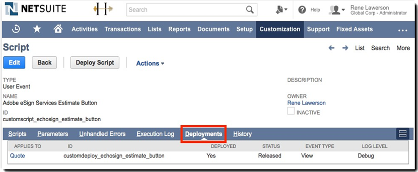
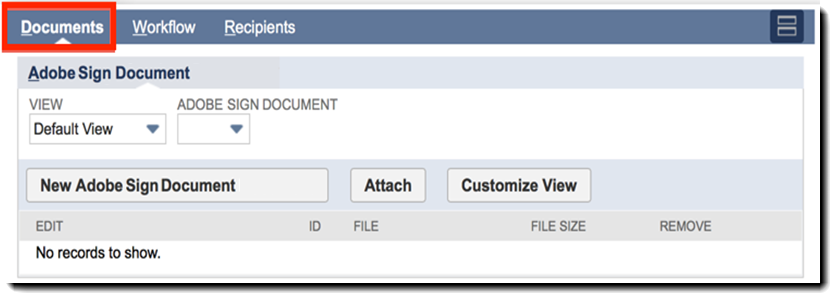

# Adobe Sign for NetSuite安装和自定义指南(v4.0.4){#install-customize-netsuite}

## 概览 {#overview}

Adobe Sign for NetSuite提供与NetSuite的完整的eSignature集成。 您可以使用Adobe Sign for Netsuite集成从NetSuite直接将合同、报价和其他需要电子签名的文档等协议发送给收件人。 您可以从客户、潜在客户、报价和其他NetSuite记录创建和发送Adobe Sign协议。 Adobe Sign使用协议的当前状态更新NetSuite，并在协议完全执行后存储与关联的NetSuite记录的协议。 您可以从产品内查看从NetSuite发送的所有协议的历史记录。

有关详细信息，请参阅[Adobe Sign for NetSuite发行说明](https://experienceleague.corp.adobe.com/docs/sign-integrations/using/netsuite/release-notes.html?lang=en)。

## 安装捆绑并配置OAuth {#install}

只有NetSuite管理员才能安装或更新捆绑包。 要配置OAuth，NetSuite管理员必须具有对Adobe Sign的管理员访问权限。 在生产帐户中安装捆绑之前，应在NetSuite沙箱帐户中安装并测试捆绑。

有关测试的详细信息，请参阅[创建Adobe Sign协议](#createagreement)。

>[!CAUTION]
>
>升级到v4.0.4的客户不应删除其现有API密钥。
>
>有关如何使用API密钥的详细信息，请参阅[设置自定义首选参数](#configure)。

### 首次安装捆绑包

1. 导航至&#x200B;**自定义> SuiteBundler >搜索和安装包**。

1. 在&#x200B;*搜索和安装包*&#x200B;页上，输入&#x200B;**Adobe Sign**&#x200B;作为关键字，然后选择&#x200B;**搜索**。

1. 选择&#x200B;**Adobe Sign**&#x200B;捆绑名称。

   

1. 在&#x200B;*捆绑详细信息*&#x200B;页上，选择&#x200B;**安装**。
1. 在&#x200B;*预览捆绑安装*&#x200B;页中，选择&#x200B;**安装捆绑**。

   （无需更改页面上的任何默认值）

   

1. 在出现的“安装”对话框中，选择&#x200B;**确定**&#x200B;以继续。

   在安装过程中，捆绑的状态显示为&#x200B;*Pending*。

   

1. 要显示更新状态，请选择&#x200B;**刷新**。

   捆绑安装完成后，*NetSuite*&#x200B;的Adobe Sign显示在&#x200B;*已安装的捆绑*&#x200B;页上。

   

1. 如果您已经是Adobe Sign客户帐户，请执行[安装或升级](#oauth)后配置OAuth的步骤。

   如果您没有Adobe Sign帐户，则可以[注册企业试用版](https://esign.adobe.com/adobe-sign-netsuite-trial-registration.html)帐户以测试系统。 按照在线注册步骤启用Adobe Sign帐户。

## 安装或升级后配置OAuth {#oauth}

Adobe Sign使用OAuth 2.0在NetSuite中验证Adobe Sign帐户。

此协议授权您安装的NetSuite包与Adobe Sign通信，无需请求密码。 由于应用程序之间不能直接共享敏感信息，因此您的帐户不太可能会受到威胁。

此身份验证不会影响您的实施，但在生产或沙箱帐户中安装或升级捆绑后，必须执行一次性配置。

配置OAuth的NetSuite管理员还必须具有对Adobe Sign的帐户级管理员访问权限。

1. 在NetSuite中，导航到&#x200B;*Adobe Sign Config*&#x200B;列表页。

1. 使用标题中的“搜索”字段搜索&#x200B;**Adobe Sign Config**（自定义记录类型）。

1. 在“搜索结果”页中，为&#x200B;*Adobe Sign Config*&#x200B;记录选择&#x200B;**视图**。

   

1. 在“Adobe Sign配置列表”页面上，为&#x200B;*使用OAuth访问Adobe Sign APIs*&#x200B;记录选择&#x200B;**查看**。

   

1. 在“Adobe Sign配置”页面上，选择&#x200B;**使用Adobe Sign**&#x200B;登录

   

1. 在显示的Adobe Sign登录页中，输入您的凭据并选择&#x200B;**登录**。

   

1. 在显示的“确认访问”页（对于OAuth）中，选择&#x200B;**允许访问**

   

1. 授权完成后，您将重定向回NetSuite中的Adobe Sign Config页，如下所示。

   

   >[!NOTE]
   >
   >如果在沙箱帐户中配置OAuth，在授权完成时将遇到错误“无法确定客户组件”。
   >
   >
   >若要继续，必须更改浏览器中URL(system.netsuite.com)的帐户域部分，以便按如下方式返回NetSuite沙箱：
   >
   >
   >更改:
   >
   >
   >system.netsuite.com/app/site/hosting/scriptlet.nl?script=745&amp;deploy=1&amp;web_access_point=https://echosign.com
   >
   >
   >收件人：
   >
   >
   >系统。**沙箱。**netsuite.com/app/site/hosting/scriptlet.nl?script=745&amp;deploy=1&amp;web_access_point=https://echosign.com

## 更新捆绑（现有用户）

NetSuite捆绑包更新由Adobe定期发布。 Adobe Sign for NetSuite集成的现有用户可更新到最新捆绑包。

>[!CAUTION]
>
>升级到较新版本的客户不应删除其现有的API密钥。
>
>有关如何使用API键的详细信息，请参阅[设置自定义首选参数](#configure)。

### 先决条件 {#prerequisites}

更新到v4.0.4捆绑包所需的时间取决于当前具有“发出进行签名”状态的协议数量。 通常，更新100个协议需要7到10分钟。 记下要估计更新时间的记录数。

要确定发出进行签名的协议数量，请执行以下操作：

1. 导航到&#x200B;**自定义>列表、记录和文件>记录类型**，然后找到&#x200B;*Adobe Sign协议。*

   或在搜索栏中搜索Adobe Sign协议。

1. 对于Adobe Sign协议记录，选择&#x200B;**搜索**。

   

1. 从&#x200B;**状态**&#x200B;下拉列表中，选择&#x200B;**发出进行签名**，然后选择&#x200B;**提交**。

   

   记下要估计更新时间的记录数。

   

### 更新捆绑 {#updating-the-bundle}

1. 导航至&#x200B;**自定义> SuiteBundler >搜索和安装>列表**&#x200B;并找到当前捆绑，如下所示。

   >[!NOTE]
   >
   >如果有新版本的捆绑，则当前捆绑的&#x200B;*版本*&#x200B;编号的右侧会显示一个惊叹号图标。

1. 从“操作”下拉菜单中，选择&#x200B;**Update**。

   

1. 在“预览包更新”页上，选择&#x200B;**更新包**，而不更改页面上显示的任何默认值。

   在安装过程中，捆绑的状态显示为&#x200B;*Pending*。

   。

   >[!NOTE]
   >
   >更新捆绑时，可能会收到一条警告消息，如下所示。 如果您尚未自定义NetSuite eSignature记录，则可以继续。 如果不确定，建议在沙箱帐户上安装捆绑，以在生产帐户中更新捆绑之前先对其进行测试。
   

1. 要显示更新状态，请选择&#x200B;**刷新**。

   

   >[!NOTE]
   >
   >如果由于您有大量&#x200B;*发出以请求签名*&#x200B;协议而导致更新似乎耗时较长，则可以检查&#x200B;*Adobe Sign捆绑安装*&#x200B;脚本的&#x200B;**执行日志**&#x200B;子选项卡，以确定更新进度。 （有关详细信息，请参阅[确定更新的进度](#determineprogress)。）

   捆绑更新完成后，*Adobe Sign for NetSuite*&#x200B;将显示在&#x200B;*已安装的捆绑*&#x200B;页面上。

   

## 配置捆绑 {#configure}

### 设置自定首选项  {#set-custom-preferences}

您可以使用自定义首选项来指定如何在NetSuite中创建和存储协议。 此外，Adobe Sign *中的*&#x200B;自动设置用户首选项允许您指定在Sign服务中NetSuite用户从NetSuite发送协议时是否自动设置。

1. 导航到&#x200B;**设置>公司>常规首选项**。
1. 向下滚动页面，然后选择“自定义首选项”**子选项卡。**

   

1. 根据需要启用和配置Adobe Sign首选项：

   * **输入帐户的EchoSign API密钥**:请勿在此字段中添加或编辑任何值。
   * **使用父记录联系人作为签名者**:如果启用，则在创建协议时，父记录联系人默认为第一位签名者。发送者可以在发送之前轻松删除或编辑默认签名者，或向协议添加其他签名者。
   * **使用Trans。如果存在**，请以签名者身份联系：仅当&#x200B;*还启用了“将父记录联系人用作签名者*”首选项时，此首选项才有效。 如果启用，则当从事务记录（如报价）生成协议时，主事务联系人默认为第一个签名者。 （有关详细信息，请参阅[事务记录](#transrecords)。） 如果没有主要事务联系人，或者如果从NetSuite对象记录（如客户记录、合作伙伴记录）发送，则默认收件人将是客户电子邮件的主要联系人。 发送者可以在发送之前轻松删除或编辑默认签名者，或向协议添加其他签名者。
   * **允许将收件人标记为审批人**:如果启用，发送者可以将收件人标记为审批人。标记为审批人的收件人可以审阅和批准协议，但不需要他们签名。 审批人可能需要在审批过程中将数据输入到字段中。
   * **首选协议文件夹Id**:用于指定将存储最终签名协议的文件夹。如果未为此字段设置值，则默认情况下，最终签名协议将保存在与原始文档文件相同的文件夹中。 文件夹ID必须是数字。
   * **自动附加事务PDF**:如果启用，则当从事务记录创建新协议时，事务PDF会自动附加到协议。
   * **将签名的PDF添加为（附件或链接）**:如 ** 果从下拉列表中选择了“列表”，则签名的PDF会自动添加为指向文件的链接。如果从下拉菜单中选择了&#x200B;*附件*，则签名的PDF将作为附件存储在NetSuite中的协议记录中。
   * **在协议中包含审核记录PDF**:如果启用，审核记录PDF将在协议签名后自动附加到协议记录。
   * **身份验证方法适用于**:启用任何身份验证方法都指示应用标识验证方法的对象。选项包括*所有签名者、仅限外部签名者、*或&#x200B;*仅限内部签名者*。

   **身份验证方法** {#identity-verification-methods}

   创建协议时，可以选择启用的身份验证方法。 如果此处启用了多个身份验证方法，则Adobe Sign协议页面会显示&#x200B;**验证签名者身份**&#x200B;选项。

   * **启用签名所需的密码**:要求签名者输入您指定的一次性密码。

   * **启用基于知识的身份验证**:要求签名者提供其姓名、地址和（可选）其SSN的最后四位数字，然后回答验证他们提供的信息的问题列表。仅在美国提供。

   * **启用Web身份验证**:要求签名者通过登录以下站点之一来验证其身份：Facebook、Google、LinkedIn、Microsoft Live、Twitter或Yahoo!。

   * **Adobe Sign中的自动预配用户**:如果启用，在NetSuite中发送协议的用户将自动使用Adobe Sign用户帐户进行自动配置。

1. 选择&#x200B;**保存**&#x200B;以保存您的首选项。

## 配置自动状态更新 {#asu}

Adobe Sign集成捆绑包允许您在NetSuite中自动接收有关从NetSuite发送的协议状态的更新。 启用此功能后，NetSuite始终反映您的协议的当前状态。 您可以启用自动状态更新，如下所示：

1. 导航到&#x200B;**设置>公司>启用功能。**
1. 选择&#x200B;**SuiteCloud**&#x200B;子选项卡。
1. 启用以下选项：

   * 在SuiteBuilder部分中，启用&#x200B;**自定义记录**&#x200B;选项。

   * 在SuiteScript部分中，启用&#x200B;**Client SuiteScript**&#x200B;和&#x200B;**Server SuiteScript**&#x200B;选项，并同意两者的服务条款。

1. 选择&#x200B;**保存**。

   您的选项将如图所示设置。

   

## 对象和记录类型 {#objects}

Adobe Sign集成包已公开包含许多标准NetSuite对象的Adobe Sign协议对象，包括：客户、估计、潜在客户、业务机会和合作伙伴记录。 您也可以将Adobe Sign捆绑与其他记录类型（包括自定义记录）一起使用。

“协议”选项卡可以显示两种类型的NetSuite记录：实体和事务记录。 我们通常假定交易记录是可转换为PDF文档的记录（如报价）；而“实体”记录无法转换为PDF。

## 交易记录 {#transrecords}

如果协议是从事务记录创建的，则协议记录上的第一个文档是它所来自记录的PDF版本，而第一个收件人是记录的电子邮件地址。 如果您不希望第一个文档是它所来记录的PDF版本，请转到&#x200B;**设置>公司>常规首选项>自定义首选项子标签**&#x200B;并禁用&#x200B;**自动附加事务PDF**&#x200B;选项。 有关详细信息，请参阅[设置自定义首选项](#configure)。

在“自定义首选项”下，还可以启用&#x200B;**使用转换。 如果您希望将主事务联系人自动添加为第一位签名者，请以第一位签名者身份联系**&#x200B;首选项。 与事务记录关联时，它显示&#x200B;**协议**&#x200B;和&#x200B;**Send for Signature**&#x200B;按钮。

## 实体记录 {#entity-records}

如果协议是从实体记录创建的，则第一个收件人是记录中的电子邮件地址。 与实体记录关联时，只显示“协议”选项卡。

## 自定义捆绑 {#customize}

自定义捆绑包括：

* 为“协议”子选项卡部署脚本，为相应的记录类型部署Send for Signature按钮。
* 为Adobe Sign记录类型设置角色权限。
* 修改权限以授予对&#x200B;*协议*&#x200B;子选项卡和&#x200B;*Send for Signature*&#x200B;按钮的访问权限。

### 为其他记录类型配置Adobe Sign协议  {#configuring-adobe-sign-agreements-for-additional-record-types}

要为相应的记录类型部署&#x200B;*协议*&#x200B;子选项卡和&#x200B;*Send for Signature*&#x200B;按钮，请执行以下操作：

1. 导航到&#x200B;**自定义>脚本>脚本。**

1. 在显示的&#x200B;*脚本*&#x200B;列表页上，找到需要部署的脚本，然后选择&#x200B;**视图**。

   * 要添加&#x200B;*Send for Signature*&#x200B;按钮，请选择&#x200B;**Adobe Sign估计按钮**&#x200B;脚本。

   * 要添加&#x200B;*协议*&#x200B;选项卡，请选择&#x200B;**Adobe Sign协议加载器**&#x200B;脚本。

1. 在“脚本”页上，选择&#x200B;**部署脚本**。

   

1. 在“脚本部署”页上，执行以下操作：

   * 从&#x200B;*应用于*&#x200B;列表中，选择记录类型。
   * （可选）输入脚本部署ID。

      有关详细信息，请参阅NetSuite帮助中心中的&#x200B;*创建自定义脚本部署ID*&#x200B;主题。 如果未输入ID，则会生成一个ID。

   * 选中&#x200B;**已部署**&#x200B;复选框。

   

   * 将&#x200B;*Status*&#x200B;设置为&#x200B;**Released**。

      无需指定&#x200B;*事件类型*&#x200B;或&#x200B;*日志级别*。

   * 从&#x200B;*执行为角色*&#x200B;下拉列表中，选择&#x200B;**执行为管理员**。

   * 在&#x200B;**Audience**&#x200B;子选项卡处于活动状态（默认为活动状态）时，选择要授予访问权限的特定角色或用户。 如果要授予所有角色和用户的访问权限，请启用相应的&#x200B;**选择所有**&#x200B;选项。

   * 选择&#x200B;**保存**。 当显示更改确认时，选择&#x200B;**返回**。

1. 选择“脚本部署”页顶部的&#x200B;**列表**&#x200B;以返回到&#x200B;*脚本*&#x200B;列表页。
1. 对其他脚本重复上述步骤2和3。

## 设置Adobe Sign记录类型的角色权限  {#setting-role-permissions-for-adobe-sign-record-types}

大多数NetSuite角色应具有使用Adobe Sign的权限，而无需进行其他自定义。 但是，您可能需要为已创建的任何其他自定义角色授予权限。

1. 导航到&#x200B;**自定义>列表、记录和文件>记录类型**。

   

   >[!NOTE]
   >
   >如果未看到&#x200B;*记录类型*&#x200B;项，请导航至&#x200B;**设置>公司>启用功能> Suite Cloud选项卡**&#x200B;并启用&#x200B;*自定义记录*&#x200B;选项。

1. 在&#x200B;*记录类型*&#x200B;页上，选择&#x200B;**Adobe Sign协议**&#x200B;以选择它

   

1. 在&#x200B;*自定义记录类型*&#x200B;页面上，从&#x200B;*访问类型*&#x200B;下拉菜单中选择&#x200B;**使用权限列表**。

   

   >[!NOTE]
   >
   >*Adobe Sign协议*&#x200B;记录类型是唯一需要&#x200B;*使用权限列表*&#x200B;访问类型的Adobe Sign记录类型。
   >
   >
   >有关设置其他Adobe Sign记录类型的访问类型的说明，请参阅步骤6。

1. 选择&#x200B;**权限**&#x200B;子选项卡。

   将显示角色和权限列表。

   

1. 为添加到“Adobe Sign协议”记录类型的其他自定义角色设置如下权限。

   >[!NOTE]
   >
   >有关详细信息，请参阅NetSuite帮助中心中的&#x200B;*[为自定义记录类型](https://system.netsuite.com/app/help/helpcenter.nl?fid=section_N2879931.html)*&#x200B;设置权限列表主题

   1. 从&#x200B;*角色*&#x200B;列表中选择角色。
   1. 将&#x200B;*Level*&#x200B;设置为&#x200B;**Full**
   1. 将&#x200B;*默认格式*&#x200B;设置为&#x200B;**自定义EchoSign协议格式**
   1. 选中&#x200B;*限制表单*&#x200B;复选框
   1. 选择&#x200B;**添加**&#x200B;以保存角色行的更改

   

   新行显示如下：

   

   对所有其他自定义角色重复上述步骤a到e。

   * 在设置了所有角色的权限后，在&#x200B;*自定义记录类型*&#x200B;页上选择&#x200B;**保存**。

   将重新显示&#x200B;*客户记录类型*&#x200B;页。

1. 重复上述步骤1到3，将所有其他Adobe Sign记录类型的&#x200B;*访问类型*&#x200B;设置为

   **无需权限。** 这适用于以下记录类型：

   * Adobe Sign配置
   * Adobe Sign 文档
   * Adobe Sign事件
   * Adobe Sign语
   * Adobe Sign脚本错误
   * Adobe Sign签名协议
   * Adobe Sign签名者

### 授予对“协议”选项卡和“Send for Signature”按钮的访问权限  {#granting-access-to-the-agreement-tab-and-send-for-signature-button}

Adobe Sign集成捆绑包已公开包含许多标准NetSuite对象（客户、估价[报价]、潜在客户等）的Adobe Sign协议对象。 *协议*&#x200B;子选项卡将自动为以下类型的对象启用：客户、潜在客户、业务机会、合作伙伴、潜在客户、报价和供应商账单。

*Send for Signature*&#x200B;按钮仅对Quote对象&#x200B;**自动启用**。

NetSuite管理员可以通过修改权限将创建协议的功能扩展到其他CRM对象，以将&#x200B;*Agreement*&#x200B;子选项卡、*Send for Signature*&#x200B;按钮或两者添加到这些对象。

#### 修改权限以授予对Send for Signature按钮的访问权限  {#modifying-permissions-to-grant-access-to-the-send-for-signature-button}

1. 导航到&#x200B;**自定义>脚本>脚本**。

   将显示&#x200B;*脚本*&#x200B;列表页。

   * 如有必要，请使用滤镜来查找Adobe Sign脚本

1. 在&#x200B;*脚本*&#x200B;页上，找到&#x200B;*Adobe Sign估计按钮*&#x200B;脚本(控制&#x200B;*Send for Signature*&#x200B;按钮)，然后选择&#x200B;**视图**。

   

1. 在&#x200B;*脚本*&#x200B;页上，执行以下操作：

   * 选择&#x200B;**部署**&#x200B;子选项卡

   * 在“*应用于*”下，选择要修改的实体的链接

      * **** 引用此示例

   

   * 在“脚本部署&#x200B;*”页上选择“编辑&#x200B;**”按钮***

   

   * 在&#x200B;**Audience**&#x200B;子选项卡处于活动状态时，选择要授予访问权限的特定角色或用户。

      * 如果要授予所有角色和用户的访问权限，请启用相应的&#x200B;**选择所有**&#x200B;选项
   * 选择&#x200B;**保存**

   

#### 修改权限以授予对“协议”选项卡的访问权限  {#modifying-permissions-to-grant-access-to-the-agreements-tab}

1. 导航到&#x200B;**自定义>脚本>脚本**
1. 在&#x200B;*脚本*&#x200B;页上，找到&#x200B;*Adobe Sign协议加载器*&#x200B;脚本（控制&#x200B;*协议选项卡*）

   * 选择&#x200B;**视图**

1. 在&#x200B;*脚本*&#x200B;页上，执行以下操作：

   1. 选择&#x200B;**部署**&#x200B;子选项卡
   1. 在“*应用于*”下，选择要修改其访问权限的实体的链接
   1. 在*脚本部署*页上，选择&#x200B;**编辑**&#x200B;按钮

   1. 在&#x200B;**Audience**&#x200B;子选项卡处于活动状态（默认情况下处于活动状态）时，选择要授予访问权限的特定角色或用户。 如果要授予所有角色和用户的访问权限，请启用相应的&#x200B;**选择所有**&#x200B;选项

   1. 选择&#x200B;**保存**

## 使用Adobe Sign for NetSuite捆绑包

为了从NetSuite发送协议并接收这些协议的更新，用户在NetSuite和Adobe Sign中必须具有相同的登录ID（电子邮件地址）。

### 创建Adobe Sign协议

在沙箱或生产帐户中安装新捆绑后，应通过创建新协议来测试捆绑。 您可以从实体记录、事务记录或独立协议创建Adobe Sign协议。

>[!NOTE]
>
>创建协议的过程会因协议的创建方式而稍有不同。 一般过程包括为协议指定选项、添加一个或多个协议文档以及指定收件人。 以下描述的流程假定您从客户记录中创建协议。

1. 选择或创建要从中发送协议的客户记录，或者可以选择启用“协议”选项卡的其他NetSuite记录类型。

1. 从记录中，选择&#x200B;**协议**&#x200B;子选项卡。
1. 选择&#x200B;**新建协议**。

   

1. 在&#x200B;*Adobe Sign协议*&#x200B;页面上，选择&#x200B;**编辑**。

   

1. 按如下方式指定协议选项：

   * **协议名称**  — 输入协议的名称。
   * **消息** — 为收件人输入自定义消息。
   * **签名类型**  — 选择文档接受的签名类型。这些选项为&#x200B;*电子签名*&#x200B;和&#x200B;*传真签名*。

   * **我还需要签署本协议**  — 启用此选项可指示发件人还需要签署协议。
   * **签名顺序** — 如果 *启用了“我还需要签* 名此协议”选项，请选择发件人和收件人签名的顺序。选项包括“我签名，收件人签名”、“收件人签名，然后我签名”和“无”。

   * **预览文档或定位签名（或表单域）**  — 启用此选项后，发送者可以预览协议，并允许他们在将协议发送给收件人之前向协议添加域（拖放签名、初始域和其他表单域）。
   * **验证签名者身份**  — 启用此选项，然后选择以下身份验证选项之一

      * 仅当在“自定义首选项”中启用了下面列出的三种签名者身份验证方法中的一种以上时，才显示此选项。 （有关详细信息，请参阅[设置自定义首选项](#customize)。） 如果仅启用了一个首选项，则不显示&#x200B;**验证签名者身份**&#x200B;选项。

   **身份验证方法**

   * **需要签名的密码**  — 要求签名者输入您指定的一次性密码。
   * **基于知识的身份验证**  — 要求签名者提供其姓名、地址和SSN的最后四位数字（可选），然后回答验证他们提供的信息的问题列表。仅在美国提供。
   * **Web身份验证**  — 要求签名者通过登录以下站点之一来验证其身份：Facebook、Google、LinkedIn、Twitter、Yahoo!或Microsoft Live。
   * **查看PDF需要密码**  — 启用此选项后，将要求收件人在打开协议或已签名协议的PDF之前输入密码。发送给每个人的PDF文件将被加密，并且需要此密码才能打开它。 不要丢失密码，因为密码无法恢复。 如果您确实丢失了密码，则需要删除该事务，然后重新开始。
   * **密码/确认密码**  — 如果启 *用了“查看* PDF需要密码”选项，请输入用于查看协议的密码。
   * **提醒收件人签名**  — 指定是否以及向收件人发送提醒的频率。选项为&#x200B;*Never*、*Daily*&#x200B;或&#x200B;*Weekly*。
   * **语言：** 指定向收件人显示签名页面和电子邮件通知时使用的语言。
   * **为第一位签名者托管签名**  — 启用此选项后，发送者将为第一位签名者托管亲临签名。
   * **截止签名截止日期的天数**  — 输入一个整数以指示协议的签名截止日期（今天的日期+天数）。
   * **父记录**  — （可选）选择父记录以将其链接到协议。

   

1. 选择&#x200B;**文档**&#x200B;选项卡。

   

1. 在&#x200B;*文档*&#x200B;子选项卡上，使用&#x200B;*Adobe Sign文档*&#x200B;下拉列表从文件柜附加现有文档，然后选择&#x200B;**附加**。

   或者，单击&#x200B;**新建Adobe Sign文档**&#x200B;以访问&#x200B;*Adobe Sign文档*&#x200B;页面，然后在NetSuite文件柜中键入文档名称，从事务记录（如果适用）中选择文件，或附加新文档。

   您可以向协议中添加多个文档。

1. 选择&#x200B;**收件人**&#x200B;子选项卡，并通过从联系人列表中选择或键入电子邮件地址来指定收件人。

   

   您的每个收件人都可以标记为“签名者”或“抄送”。 如果启用了&#x200B;*允许将收件人标记为审批人签名者*&#x200B;自定义首选项，则收件人也可以标记为审批人。 有关详细信息，请参阅[设置自定义首选参数](#customize)。

   * **签** 名者必须签署协议。
   * **审** 批人必须批准协议，但不签署协议，并且可能需要向协议添加数据。
   * **协议更新** 以及协议签名和完成时，将通知抄送的收件人。CC收件人不是签名或审批流程的参与方。

      如果单独启用了&#x200B;*将父记录联系人用作签名者*&#x200B;自定义首选项，或者与&#x200B;*使用转换一起启用。 联系人为签名者*&#x200B;首选项，第一个收件人是默认收件人，但可以更改。

1. 输入每个收件人后，选择&#x200B;**添加**。

1. 选择&#x200B;**保存**&#x200B;以保存协议。

### 发送协议以供签名

当协议准备好发送时，选择&#x200B;**Send for Signature**&#x200B;按钮。

* 如果&#x200B;*预览文档或位置签名*&#x200B;选项已启用，请单击&#x200B;**Send for Signature**。 在打开的窗口中，预览文档或将表单域拖动到文档，然后再发送文档。 选择&#x200B;**发送**&#x200B;将协议发送给收件人。

* 如果启用了“为第一位签名者&#x200B;*托管签名”选项，请单击“**Send for Signature**”。*&#x200B;在打开的窗口中，允许签名者使用发件人签名文档。

   *当前签名者的主机签名*&#x200B;链接也显示在&#x200B;*第一个签名者的主机签名*&#x200B;字段旁边，在文档签名之前，可以访问该字段。 使用此链接可托管多个签名者的协议签名，或者在弹出窗口意外关闭时重新打开该窗口。

在发送协议后，收件人会收到一封电子邮件，通知他们等待其签名的文档。

在收件人签名文档后，发件人会通过电子邮件收到文档已签名的通知。

#### 从报价发送

Adobe Sign与NetSuite中的报价直接集成，因此报价的PDF会自动生成并附加到协议记录。

查看报价时，请选择&#x200B;**Send for Signature**。 它生成并显示附加到协议的报价。 您还可以将&#x200B;*Send for Signature*&#x200B;按钮添加到其他事务记录类型。 有关详细信息，请参阅[对象和记录类型](#objects)。

### 跟踪状态和发送提醒

发送协议后：

* 在“协议详细信息”部分中，文档状态将更改为&#x200B;*发出进行签名*
* *Send for Signature*&#x200B;按钮由以下三个按钮替换：

   * **更新状态**  — 如果尚未配置状态更新，请选择此按钮手动更新状态。有关详细信息，请参阅[配置自动状态更新](#asu)。
   * **发送提醒**  — 选择此按钮可向当前签名者发送提醒。
   * **取消协议**  — 选择此按钮可取消协议。如果所有收件人尚未签名，则协议在发送以请求签名后可能会被取消。

协议记录中将显示新的&#x200B;*事件*&#x200B;子选项卡，您可以在其中跟踪协议的状态。

您可以查看协议事件的历史记录，其中包括有关协议何时发送、查看和签名的信息。

协议签署后：

* 其状态更改为&#x200B;*已签名*。
* 您可以使用该链接链接返回到此协议的父记录。
* 您可以使用签名文档和审核记录下的“下载”链接访问这些文档。
* 此时会显示另一个&#x200B;*签名文档*&#x200B;子选项卡，用于查看已签名文档的缩览图。

>[!NOTE]
>
>在发送协议以请求签名后，您将无法编辑记录。 这是为了保留事件的记录。

## 卸载捆绑

要卸载捆绑包，请按照NetSuite帮助中提供的步骤操作。 有关详细信息，请参阅NetSuite帮助中心中的&#x200B;*[卸载Bundle](https://docs.oracle.com/cloud/latest/netsuitecs_gs/NSBDL/NSBDL.pdf)*&#x200B;主题。

卸载捆绑包时，将删除未签名的协议。 签名的协议及其相应的审核PDF文件不受影响。

如果需要保留未签名的协议，请不要卸载捆绑包。

## 疑难解答

### 确定更新的进度

如果更新的时间似乎超过，您可以检查Adobe Sign捆绑安装脚本的“执行日志”子选项卡，以确定更新的进度，如下所示：

1. 导航到&#x200B;**自定义>脚本>脚本**。
1. 在&#x200B;*脚本*&#x200B;页上，找到&#x200B;*Adobe Sign捆绑安装*&#x200B;脚本，然后选择&#x200B;**编辑**。
1. 在&#x200B;*脚本*&#x200B;页上，选择&#x200B;**执行日志**&#x200B;子选项卡。
1. 选择&#x200B;**刷新**。

   执行日志将更新以反映当前状态。 *Details*&#x200B;列显示协议更新的进度。

   

### 解决访问令牌问题

在与协议交互时，您可能会遇到“提供的访问令牌无效或已过期”消息。

这可能由于以下原因而发生：

* 配置OAuth的NetSuite/Adobe Sign管理员已吊销访问令牌
* 访问令牌已过期，因为过去60天内没有从NetSuite发送协议
* NetSuite/Adobe Sign管理员未成功完成初始OAuth配置

要解决此问题，请再次执行OAuth配置进程。 有关详细信息，请参阅[在安装或升级](#oauth)后配置OAuth。

### 解决文档状态问题 {#resolvestatus}

如果配置了[自动状态更新](#asu)，但在发送协议后协议状态未更新，请尝试以下操作：

1. 检查&#x200B;*Adobe Sign External Update*&#x200B;脚本的部署执行日志，以查看您是否正在接收来自Adobe Sign的调用，如下所示：

   1. 导航到&#x200B;**自定义>脚本>脚本部署**
   1. 在&#x200B;*脚本部署*&#x200B;页上，找到&#x200B;*Adobe Sign外部更新*&#x200B;脚本，然后选择&#x200B;**编辑**
      1. 在&#x200B;*脚本部署*&#x200B;页上，选择&#x200B;**执行日志**&#x200B;子选项卡。
      * 对于每个协议ID，应显示&#x200B;*更新的协议记录*&#x200B;条目

1. 检查&#x200B;*Adobe Sign更新协议*&#x200B;脚本的部署执行日志，以查看是否存在以下错误：

   1. 导航到&#x200B;**自定义>脚本>脚本部署**。
   1. 在&#x200B;*脚本部署*&#x200B;页上，找到状态为“Scheduled”的&#x200B;*Adobe Sign Update Agreements*&#x200B;脚本，然后选择&#x200B;**编辑**。
   1. 在&#x200B;*脚本部署*&#x200B;页上，选择&#x200B;**执行日志**&#x200B;子选项卡。
   1. 在&#x200B;*类型*&#x200B;下，选择&#x200B;**错误**&#x200B;以过滤结果。

1. 最后，按照上面步骤2中的说明检查&#x200B;*Adobe Sign Manager*&#x200B;脚本的执行日志中是否有错误。

### 解决MIME类型错误  {#resolving-mime-type-errors}

如果在发送协议时遇到MIME类型错误，可能是因为“文件名”字段中的名称与已上载文件的文件名和扩展名不匹配。 如果将“文件名”字段留空，将自动使用正确的文件名和扩展名填充。

### 查看脚本日志 {#viewing-script-logs}

您还可以查看与文档状态问题无关的脚本的部署执行日志。 有关详细信息，请参阅[解决文档状态问题](#resolvestatus)。

1. 导航到&#x200B;**自定义>脚本>脚本**。

   将显示&#x200B;*脚本*&#x200B;列表页。 如有必要，请使用滤镜来查找相应的脚本。

1. 选择&#x200B;**视图**&#x200B;作为相应脚本。

1. 在页面上选择&#x200B;**执行日志**&#x200B;子选项卡以显示脚本日志。

## 支持 {#support}

转到[Adobe Sign支持门户](https://adobe.com/go/adobesign-support-center_cn)以访问常见问题解答、文档、知识库文章，或联系Adobe支持。
