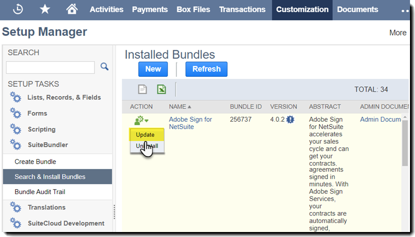
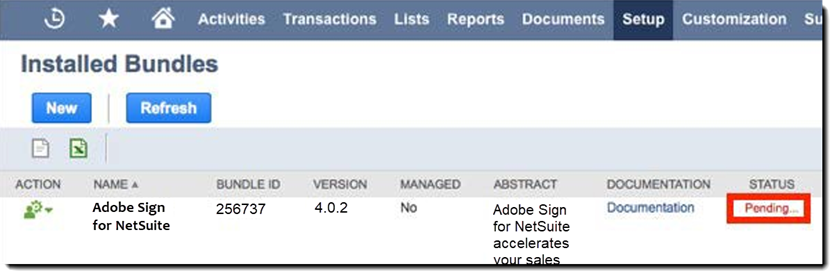
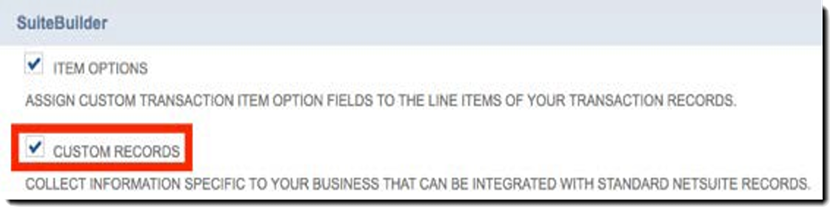
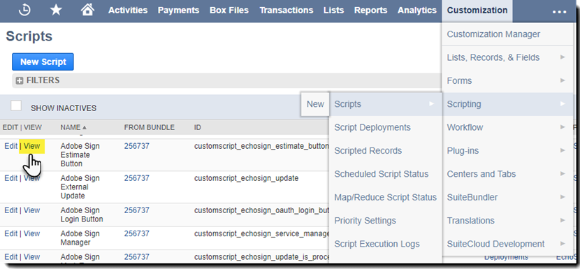

# [!DNL NetSuite] 安装和自定义指南(v4.0.4) {#install-customize-NetSuite}

## 概览 {#overview}

适用于 [!DNL NetSuite] 提供与 [!DNL NetSuite]的 您可将Adobe Sign用于 [!DNL NetSuite] 集成可直接从 [!DNL NetSuite]的 您可以从客户、潜在客户、报价和其他人创建和发送Adobe Sign协议 [!DNL NetSuite] 记录。 Adobe Sign更新 [!DNL NetSuite] 并存储与关联方之间的协议 [!DNL NetSuite] 完全执行记录后。 您可以查看所有发送协议的历史记录 [!DNL NetSuite] 从产品内部。

请参阅 [适用于 [!DNL NetSuite] 发行说明](https://experienceleague.adobe.com/docs/sign-integrations/using/netsuite/release-notes.html?lang=en) 了解更多信息。

## 安装捆绑包并配置OAuth {#install}

仅 [!DNL NetSuite] 管理员可以安装或更新该捆绑包。 要配置OAuth， [!DNL NetSuite] 管理员必须拥有对Adobe Sign的管理员访问权限。 在生产帐户中安装包之前，您应在以下位置安装和测试该包： [!DNL NetSuite] 沙箱帐户。

请参阅 [创建Adobe Sign协议](#createagreement) 有关测试的更多信息。

>[!CAUTION]
>
>升级到4.0.4版本的客户不应删除其现有的API密钥。
>
>请参阅 [设置自定义首选项](#configure) 了解关于如何使用API密钥的详细信息。

### 首次安装捆绑包

1. 导航至 [!UICONTROL **自定义> SuiteBundler >搜索和安装捆绑包**]&#x200B;的

1. 在 *搜索和安装捆绑包* 页面，输入 **Adobe Sign** as关键字并选择 **[!UICONTROL 搜索]**&#x200B;的

1. 选择 **Adobe Sign** 捆绑包名称。

   

1. 在 *[!UICONTROL 捆绑包详细信息]* 页面，选择 **[!UICONTROL 安装]**&#x200B;的
1. 在 *[!UICONTROL 预览捆绑安装]* 页面，选择 **[!UICONTROL 安装包]**&#x200B;的

   （不得更改页面上的任何默认值）

   

1. 在出现的安装对话框中，选择 **[!UICONTROL 确定]** 继续。

   在安装过程中，捆绑的状态显示为 *[!UICONTROL 待处理]*&#x200B;的

   

1. 要显示更新状态，请选择 **[!UICONTROL 刷新]**&#x200B;的

   捆绑安装完成后， *适用于[!DNL NetSuite]* 显示在 *[!UICONTROL 已安装的捆绑包]* 页面。

   

1. 如果您已经是Adobe Sign客户帐户，请按照以下步骤执行操作：  [安装或升级后配置OAuth](#oauth)的

   如果您没有Adobe Sign帐户，则可以 [注册企业试用版](https://esign.adobe.com/adobe-sign-[!DNL NetSuite]-trial-registration.html)帐户以测试系统。 请按照在线注册步骤启用您的Adobe Sign帐户。

## 安装或升级后配置OAuth {#oauth}

Adobe Sign使用OAuth 2.0验证您的Adobe Sign帐户 [!DNL NetSuite]的

此协议授权您安装 [!DNL NetSuite] 捆绑以与Adobe Sign通信而无需请求密码。 由于应用程序之间不能直接共享敏感信息，因此您的帐户不太可能会受到威胁。

此身份验证不会影响您的实现，但在生产或沙箱帐户中安装或升级捆绑后，您必须进行一次性配置。

在 [!DNL NetSuite] 配置OAuth的管理员还必须具有对Adobe Sign的帐户级别管理员访问权限。

1. 在 [!DNL NetSuite]，导航至 *Adobe Sign Config* 列表页面。

1. 搜索 **[!UICONTROL Adobe Sign Config]** （自定义记录类型）。

1. 在“搜索结果”页面中，选择 **视图** 对于 *Adobe Sign Config* 录制。

   

1. 在“Adobe Sign配置列表”页面上，选择 **[!UICONTROL 视图]** 对于 *使用OAuth访问Adobe Sign API* 录制。

   

1. 在“Adobe Sign Config”（配置页面）中，选择 **[!UICONTROL 使用Adobe Sign登录]**

   

1. 在显示的Adobe Sign登录页面中，输入凭据并选择 **[!UICONTROL 登录]**&#x200B;的

   

1. 在显示的“确认访问”页面（对于OAuth）中，选择 **[!UICONTROL 允许访问]**

   

1. 授权完成后，您将被重定向回Adobe Sign配置页面，该页面位于 [!DNL NetSuite]，如下所示。

   

   >[!NOTE]
   >
   >在沙箱帐户中配置OAuth时，授权完成时可能会遇到“无法确定客户合成ID”错误。
   >
   >
   >若要继续，您必须更改URL（系统）的帐户域部分。[!DNL NetSuite].com)，以返回 [!DNL NetSuite] 沙箱，如下所示：
   >
   >
   >更改:
   >
   >
   >系统。[!DNL NetSuite].com/app/site/hosting/scriptlet.nl?script=745&amp;deploy=1&amp;web_access_point=https://echosign.com
   >
   >
   >收件人：
   >
   >
   >系统。**沙箱。**[!DNL NetSuite].com/app/site/hosting/scriptlet.nl?script=745&amp;deploy=1&amp;web_access_point=https://echosign.com

## 更新捆绑包（现有用户）

[!DNL NetSuite] 捆绑更新定期由Adobe发布。 适用于 [!DNL NetSuite] 集成可以更新到最新的捆绑包。

>[!CAUTION]
>
>升级到较新版本的客户不应删除其现有API密钥。
>
>请参阅 [设置自定义首选项](#configure) 了解关于如何使用API密钥的详细信息。

### 先决条件 {#prerequisites}

更新到4.0.4版捆绑包所需的时间取决于当前状态为“发出进行签名”的协议数。 通常情况下，更新100个协议需要7-10分钟。 记下记录的数量，以估计更新时间。

要确定发出进行签名的协议数，请执行以下操作：

1. 导航至 **[!UICONTROL 自定义>列表、记录和文件>记录类型]**，然后查找 *Adobe Sign协议。*

   或在搜索栏中搜索Adobe Sign协议。

1. 对于 [!UICONTROL Adobe Sign Agreements] 录制，选择 **[!UICONTROL 搜索]**&#x200B;的

   

1. 从 **[!UICONTROL 状态]** 下拉列表中，选择 **[!UICONTROL 发出进行签名]** 然后选择 **[!UICONTROL 提交]**&#x200B;的

   

   记下记录的数量，以估计更新时间。

   

### 更新捆绑包 {#updating-the-bundle}

1. 导航至 **[!UICONTROL 自定义> SuiteBundler >搜索和安装>列表]** 找到您当前的捆绑包，如下所示。

   >[!NOTE]
   >
   >如果该捆绑包有新版本，则其右侧会显示一个惊叹号图标 *版本* 当前捆绑的数量。

1. 从操作下拉菜单中，选择 **[!UICONTROL 更新]**&#x200B;的

   

1. 在“预览捆绑包更新”页面上，选择 **[!UICONTROL 更新捆绑包]** 而不更改页面上显示的任何默认值。

   在安装过程中，捆绑的状态显示为 *待处理*&#x200B;的

   的

   >[!NOTE]
   >
   >更新捆绑时，您可能会收到以下警告消息。 如果您尚未自定义 [!DNL NetSuite] 电子签名记录，您可以继续。 如果不确定，则建议您在沙箱帐户上安装该捆绑包，先对其进行测试，然后再在生产帐户中更新该捆绑。

   

1. 要显示更新状态，请选择 **[!UICONTROL 刷新]**&#x200B;的

   

   >[!NOTE]
   >
   >如果由于与 *发出进行签名* 状态，您可以检查 **[!UICONTROL 执行日志]** 子标签 *Adobe Sign Bundle Installation* 脚本来确定更新的进度。 请参阅 [确定更新的进度](#determineprogress) 了解更多信息。

   完成捆绑更新后， *适用于[!DNL NetSuite]* 显示在 *已安装的捆绑包* 页面。

   

## 配置捆绑包 {#configure}

### 设置自定义首选项  {#set-custom-preferences}

您可以使用自定义首选项来指定如何在中创建和存储协议 [!DNL NetSuite]的 此外， *在Adobe Sign中自动配置用户* 首选项允许您指定是否 [!DNL NetSuite] 当用户发送协议时，会在Sign服务中自动设置用户。 [!DNL NetSuite]的

1. 导航至 **[!UICONTROL 设置>公司>常规首选项]**&#x200B;的
1. 向下滚动页面，然后选择 **[!UICONTROL 自定义首选项]** 子选项卡。

   

1. 根据需要启用和配置Adobe Sign首选项：

   * **为您的帐户输入EchoSign API密钥**:不要在此字段中添加或编辑任何值。
   * **将父记录联系人用作签名者**:如果启用，则在创建协议时，父记录联系人默认为第一位签名者。 发件人可以轻松删除或编辑默认签名者，或在发送之前向协议添加其他签名者。
   * **使用Trans。 作为签名者联系（如有）**:只有当 *将父记录联系人用作签名者* 首选项也已启用。 如果启用，在从事务处理记录（例如，报价）生成协议时，主要事务处理联系人默认为第一位签名者。 请参阅 [交易记录](#transrecords) 了解更多信息。 如果没有主要事务联系人，或者发送方 [!DNL NetSuite] 对象记录（例如，客户记录、合作伙伴记录），默认收件人是客户电子邮件的主要联系人。 发件人可以轻松删除或编辑默认签名者，或在发送之前向协议添加其他签名者。
   * **允许将收件人标记为审批人**:如果启用，发件人可以将收件人标记为审批人。 标记为审批人的收件人可以审阅和批准协议，但不需要他们签署协议。 在审批过程中，审批人可能需要在字段中输入数据。
   * **首选协议文件夹ID**:用于指定存储最终签名协议的文件夹。 如果您不为此字段设置值，则默认情况下，最终签名协议将保存在原始文档文件所在的文件夹中。 文件夹ID必须为数字。
   * **自动附加事务PDF**:如果启用，当从事务PDF记录创建新协议时，事务文档将自动附加到协议。
   * **将签名PDF添加为（附件或链接）**:如果 *列表* 自动添加已签名PDF作为文件链接。 如果 *附件* ，则签名的PDF将存储在 [!DNL NetSuite] 作为协议记录上的附件。
   * **在协议中包含审计PDF记录**:如果启用，在签署协议后，审核记录PDF将自动附加到协议记录。
   * **身份验证方法适用于**:启用任意一种身份验证方法可指定将身份验证方法应用于的人员。 选项包括 *所有签名者，仅限外部签名者*&#x200B;或 *仅限内部签名者*&#x200B;的

   **身份验证方法** {#identity-verification-methods}

   在创建协议时，可以选择已启用的身份验证方法。 如果启用了多种身份验证方法，则Adobe Sign协议页面会显示 **[!UICONTROL 验证签名者身份]** 选项。

   * **启用签名所需的密码**:要求签名者输入您指定的一次性密码。

   * **启用基于知识的身份验证**:要求签名者提供他们的姓名、地址和（可选）SSN的最后四位数字，然后回答一系列问题，以验证他们提供的信息。 仅在美国提供。

   * **启用Web身份验证**:要求签名者通过登录以下网站之一来验证其身份：Facebook、Google、LinkedIn、Microsoft Live、Twitter或Yahoo!。

   * **在Adobe Sign中自动配置用户**:如果启用，发送协议的用户 [!DNL NetSuite] 都会使用Adobe Sign用户帐户自动设置。

1. 选择 **[!UICONTROL 保存]** 以保存首选项。

## 配置自动状态更新 {#asu}

Adobe Sign集成捆绑包允许您自动在中接收更新 [!DNL NetSuite] 关于已发送协议的状态 [!DNL NetSuite]的 启用此功能后， [!DNL NetSuite] 始终反映协议的状态。 您可以按如下方式启用自动状态更新：

1. 导航至 **[!UICONTROL 设置>公司>启用功能]的**
1. 选择 **[!UICONTROL SuiteCloud]** 子选项卡。
1. 启用以下选项：

   * 在SuiteBuilder部分中，启用 **[!UICONTROL 自定义记录]** 选项。

   * 在SuiteScript部分中，启用 **[!UICONTROL 客户端SuiteScript]** 和 **[!UICONTROL Server SuiteScript]** 并同意两种解决方案的服务条款。

1. 选择 **[!UICONTROL 保存]**&#x200B;的

   您的选项如下图所示。

   

## 对象和记录类型 {#objects}

Adobe Sign集成捆绑已公开包含许多标准的Adobe Sign协议对象 [!DNL NetSuite] 对象，包括：客户、评估、潜在客户、商机和合作伙伴记录。 您也可以将Adobe Sign捆绑与其他记录类型（包括自定义记录）一起使用。

“协议”选项卡可显示为两种类型 [!DNL NetSuite] 记录：实体和交易记录记录。 我们通常假定事务记录是可转换为PDF文档的记录（如报价）；而实体记录则无法转换为PDF。

## 交易记录 {#transrecords}

如果协议是从事务记录创建的，则协议记录上的第一个PDF是记录的原始版本，第一个接收者是记录的电子邮件地址。 如果您不希望第一个文档是来自它的PDF记录，请转到 **[!UICONTROL 设置>公司>常规首选项>自定义首选项子选项卡]** 并禁用 **[!UICONTROL 自动附加事务PDF]** 选项。 请参阅 [设置自定义首选项](#configure) 了解更多信息。

在“自定义首选项”下，您还可以启用 **[!UICONTROL 使用Trans。 作为第一位签名者联系]** 首选项 — 如果希望将主要事务联系人自动添加为第一位签名者。 与事务记录关联时，它显示 **[!UICONTROL 协议]** 和 **[!UICONTROL Send for Signature]** 按钮。

## 实体记录 {#entity-records}

如果协议是从实体记录创建的，则第一个收件人是记录中的电子邮件地址。 与实体记录关联时，仅显示协议选项卡。

## 自定义捆绑包 {#customize}

自定义捆绑包括以下内容：

* 部署相应记录类型的“协议”子选项卡和“Send for Signature”按钮的脚本。
* 正在为Adobe Sign记录类型设置角色权限。
* 修改权限以授予对的访问权限 *协议* 子选项卡和 *Send for Signature* 按钮。

### 配置Adobe Sign协议以获取其他记录类型  {#configuring-adobe-sign-agreements-for-additional-record-types}

要部署 *协议* 子选项卡和 *Send for Signature* 按钮：

1. 导航至 **[!UICONTROL 自定义>脚本>脚本]的**

1. 在 *脚本* 找到必须部署的脚本，然后选择 ****[!UICONTROL 视图]****&#x200B;的

   * 要添加 *Send for Signature* 按钮，选择 **[!UICONTROL Adobe Sign“预估”按钮]** 脚本。

   * 要添加 *协议* 选项卡，选择 **[!UICONTROL Adobe Sign Agreement Loader]** 脚本。

1. 在“脚本”页面上，选择 **[!UICONTROL 部署脚本]**&#x200B;的

   

1. 在“脚本部署”页上，执行以下操作：

   * 从 *适用于* 列表中，选择记录的类型。
   * 或者，输入脚本部署ID。

      请参阅 *创建自定义脚本部署ID* 中的主题 [!DNL NetSuite] 有关更多信息，请参阅帮助中心。 如果不输入ID，将生成一个ID。

   * 请查看 **[!UICONTROL 已部署]** 复选框。

   

   * 设置 *状态* 来 **[!UICONTROL 已发布]**&#x200B;的

      您不必指定 *事件类型* 或 *日志级别*&#x200B;的

   * 从 [!UICONTROL *作为角色执行]*下拉列表中，选择 **[!UICONTROL 以管理员身份执行]**&#x200B;的

   * 使用 **[!UICONTROL Audience]** 子选项卡处于活动状态（默认情况下处于活动状态），选择要授予访问权限的特定角色或用户。 如果要为所有角色和用户授予访问权限，请启用相应的 **[!UICONTROL 全选]** 选项。

   * 选择 **[!UICONTROL 保存]**&#x200B;的 当显示更改确认时，选择 **[!UICONTROL 返回]**&#x200B;的

1. 选择 **[!UICONTROL 列表]** 位于“脚本部署”页面的顶部，可返回 *脚本* 列表页面。
1. 为其他脚本重复上述步骤2和步骤3。

## 设置Adobe Sign记录类型的角色权限 {#setting-role-permissions-for-adobe-sign-record-types}

最多 [!DNL NetSuite] 角色应有权使用Adobe Sign，而无需进行其他自定义。 但是，您必须为创建的任何其他自定义角色授予权限。

1. 导航至 **[!UICONTROL 自定义>列表、记录和文件>记录类型]**&#x200B;的

   

   >[!NOTE]
   >
   >如果您没有看到 *记录类型* 项目，导航到 **[!UICONTROL 设置>公司>启用功能> Suite Cloud选项卡]** 并启用 *自定义记录* 选项。

1. 在 *记录类型* 页面，选择 **[!UICONTROL Adobe Sign协议]** 以将其选中

   

1. 在 *自定义记录类型* 页面，选择 **[!UICONTROL 使用权限列表]** 从 *访问类型* 下拉菜单。

   

   >[!NOTE]
   >
   >在 *Adobe Sign协议* 记录类型是唯一需要 *使用权限列表* 访问类型。
   >
   >
   >有关为其他Adobe Sign记录类型设置访问类型的说明，请参阅步骤6。

1. 选择 **[!UICONTROL 权限]** 子选项卡。

   此时会显示角色和权限列表。

   

1. 按如下所示为添加到“ ”的其他自定义角色设置权限[!UICONTROL Adobe Sign协议]”记录类型。

   >[!NOTE]
   >
   >请参阅 *[设置自定义记录类型的权限列表](https://system)。[!DNL NetSuite].com/app/help/helpcenter.nl?fid=section_N2879931.html)* 中的主题 [!DNL NetSuite] Help Center以了解更多信息

   1. 从 *角色* 列表中。
   1. 设置 *级别* 来 **[!UICONTROL 完全]**&#x200B;的
   1. 设置 *默认表单* 来 **[!UICONTROL 自定义EchoSign协议表单]**&#x200B;的
   1. 选择 **[!UICONTROL 限制表单]** 复选框。
   1. 选择 **[!UICONTROL 添加]** 以保存对角色行的更改。

   

   新行显示如下：

   

   对所有其他自定义角色重复上述步骤a到e。

   * 选择 **[!UICONTROL 保存]** 在 *自定义记录类型* 页面。
   在 *[!UICONTROL 客户记录类型]* 页面重新显示。

1. 重复上面的步骤1到3，将 *访问类型* 对于所有其他Adobe Sign记录类型

   **[!UICONTROL 无需权限]的** 这适用于以下记录类型：

   * Adobe Sign Config
   * Adobe Sign 文档
   * Adobe Sign事件
   * Adobe Sign语
   * Adobe Sign脚本错误
   * Adobe Sign Signed Agreement
   * Adobe Sign Signer

### 授予对“协议”选项卡和“Send for Signature”按钮的访问权限  {#granting-access-to-the-agreement-tab-and-send-for-signature-button}

Adobe Sign集成捆绑已公开包含许多标准的Adobe Sign协议对象 [!DNL NetSuite] 对象（客户、估计） [报价]、潜在客户等)。 在 *协议* 将自动为以下对象类型启用子选项卡：客户、潜在客户、业务机会、合作伙伴、潜在客户、报价和供应商账单。

在 *[!UICONTROL Send for Signature]* 按钮自动启用 **o[!UICONTROL 仅用于Quote对象]**&#x200B;的

[!DNL NetSuite] 管理员可以通过修改权限来添加 *协议* 子选项卡， *Send for Signature* 按钮，或同时选择这两个对象。

#### 修改权限以授予对“Send for Signature”按钮的访问权限  {#modifying-permissions-to-grant-access-to-the-send-for-signature-button}

1. 导航至 **[!UICONTROL 自定义>脚本>脚本]**&#x200B;的

   在 *脚本* 显示列表页面。

   * 如有必要，请使用筛选器查找Adobe Sign脚本

1. 在 *脚本* 页面，找到 *Adobe Sign“预估”按钮* 脚本(控制 *Send for Signature* 按钮)，然后选择 **视图**&#x200B;的

   

1. 在 *脚本* 页面，请执行以下操作：

   * 选择 **[!UICONTROL 部署]** 子选项卡

   * 在“*适用于*”选择要修改的实体的链接。

      * **[!UICONTROL 报价]** 在此示例中

   

   * 选择 **[!UICONTROL 编辑]** 按钮 *脚本部署* 页面

   

   * 使用 **[!UICONTROL Audience]** 子选项卡处于活动状态时，选择要授予其访问权限的特定角色或用户。

      * 如果要为所有角色和用户授予访问权限，请启用相应的 **[!UICONTROL 全选]** 选项
   * 选择 **[!UICONTROL 保存]**

   

#### 修改权限以授予对“协议”选项卡的访问权限  {#modifying-permissions-to-grant-access-to-the-agreements-tab}

1. 导航至 **[!UICONTROL 自定义>脚本>脚本]**
1. 在 [!UICONTROL 脚本] 页面，找到 *[!UICONTROL Adobe Sign Agreement Loader]* 脚本(控制 *“协议”选项卡*)图标，然后选择 **[!UICONTROL 视图]**&#x200B;的
1. 在 *脚本* 页面，请执行以下操作：

   1. 选择 **[!UICONTROL 部署]** 子选项卡
   1. 在“*[!UICONTROL 适用于]*”选择要修改其访问权限的实体的链接
   1. 在 *[!UICONTROL 脚本部署]* 页面，选择 **[!UICONTROL 编辑]** 按钮
   1. 使用 **[!UICONTROL Audience]** 子选项卡处于活动状态（默认处于活动状态），选择要授予访问权限的特定角色或用户。 如果要为所有角色和用户授予访问权限，请启用相应的 **[!UICONTROL 全选]** 选项
   1. 选择 **[!UICONTROL 保存]**

## 将Adobe Sign用于 [!DNL NetSuite] 捆绑

要从 [!DNL NetSuite] 若要接收有关这些协议的更新，用户必须在帐户中拥有相同的登录ID（电子邮件地址）， [!DNL NetSuite] 以及Adobe Sign。

### 创建Adobe Sign协议

在沙箱或生产帐户中安装新捆绑后，您应通过创建新协议来测试该捆绑。 您可以从实体记录、事务记录或独立协议中创建Adobe Sign协议。

>[!NOTE]
>
>创建协议的过程因创建方法的不同而略有不同。 一般过程涉及指定协议的选项、添加一个或多个协议文档以及指定收件人。 下述过程假定您将从客户记录创建协议。

1. 选择或创建要从中发送协议的客户记录，或者您可以选择其他客户记录 [!DNL NetSuite] 启用了“协议”选项卡的记录类型。

1. 从记录中，选择 **[!UICONTROL 协议]** 子选项卡。
1. 选择 **[!UICONTROL 新协议]**&#x200B;的

   

1. 在 *[!UICONTROL Adobe Sign协议]* 页面，选择 **[!UICONTROL 编辑]**&#x200B;的

   

1. 按如下方式指定协议的选项：

   * **协议名称**  — 输入协议名称。
   * **消息** — 输入收件人的自定义消息。
   * **签名类型**  — 选择文档接受的签名类型。 选项包括 *电子签名* 和 *传真签名*&#x200B;的

   * **我还必须签署本协议**  — 启用此选项以指示发件人还需要签署协议。
   * **签名顺序** — 如果 *我还必须签署本协议* 选项，请选择发件人和收件人签名的顺序。 这些选项包括“我签名，然后收件人签名”、“收件人签名，然后我签名”和“无”。

   * **预览文档或定位签名（或表单字段）**  — 启用此选项后，发送者可以预览协议，并允许他们在向收件人发送协议之前，向协议添加字段（拖放签名、缩写签名字段和其他表单字段）。
   * **验证签名者身份**  — 启用此选项，然后选择以下身份验证选项之一

      * 仅当在“自定义首选项”中启用了下列三种签名者身份验证方法中的多种时，才会显示此选项。 (请参阅 [设置自定义首选项](#customize) 了解更多信息。) 如果仅启用了一个首选项， **[!UICONTROL 验证签名者身份]** 选项。

   **身份验证方法**

   * **签名所需的密码**  — 要求签名者输入您指定的一次性密码。
   * **基于知识的身份验证**  — 要求签名者提供他们的姓名、地址和（可选）SSN的最后四位数字，然后回答一系列问题，以验证他们提供的信息。 仅在美国提供。
   * **Web身份验证**  — 要求签名者通过登录以下网站之一来验证其身份：Facebook、Google、LinkedIn、Twitter、Yahoo! 或Microsoft Live。
   * **查看PDF所需的密码**  — 启用此选项可要求收件人在打开协议或签名协议的PDF之前输入密码。 发送给每个人的PDF文件均经过加密，并需要密码才能打开该文件。 不要丢失您的密码，因为它无法恢复。 如果您丢失了密码，必须删除该事务并再次开始。
   * **密码/确认密码**  — 如果 *查看PDF所需的密码* 选项，请输入用于查看协议的密码。
   * **提醒收件人签名**  — 指定是否向收件人发送提醒以及提醒的频率。 选项包括 *从不*, *每天* 或 *每周*&#x200B;的
   * **语言：** 指定向收件人显示签名页面和电子邮件通知时使用的语言。
   * **托管第一位签名者的签名**  — 启用此选项将允许发件人主持第一位签名者的亲自签名。
   * **签名截止日期前的天数**  — 输入一个整数，以指示协议的签名期限（今天的日期+天数）。
   * **父记录**  — （可选）选择父记录以将其链接到协议。

   

1. 选择 **[!UICONTROL 文档]** 选项卡。

   

1. 在 *文档* 子选项卡，使用 *Adobe Sign Document* 下拉菜单，然后选择 **[!UICONTROL 附加]**&#x200B;的

   或者，单击 **[!UICONTROL 新建Adobe Sign文档]** 要访问 *[!UICONTROL Adobe Sign Document]* 页面，然后在 [!DNL NetSuite] 文件柜、从事务记录中选择文件（如果适用），或附加新文档。

   您可以在协议中添加多个文档。

1. 选择 **[!UICONTROL 收件人]** 子选项卡并通过从联系人列表中进行选择或键入电子邮件地址来指定收件人。

   

   您的每位收件人都可以标记为签名者或抄送。 如果 *允许将收件人标记为审批人签名者* 启用自定义首选项后，收件人也可以标记为审批人。 请参阅 [设置自定义首选项](#customize) 了解更多信息。

   * **签名者** 必须签署协议。
   * **审批人** 必须批准协议，但不能签署协议，并且可能选择性地必须向协议添加数据。
   * **抄送收件人** 在协议更新以及签名和完成协议时收到通知。 抄送收件人不是签名或审批流程的一方。

      如果 *将父记录联系人用作签名者* 自定义首选项单独或与 *使用Trans。 作为签名者联系* 首选项，则会默认第一个收件人，但是可以更改。

1. 选择 **[!UICONTROL 添加]** 输入每个收件人之后。

1. 选择 **[!UICONTROL 保存]** 以保存协议。

### 发送协议以供签名

当准备好发送协议时，请选择 **[!UICONTROL Send for Signature]** 按钮。

* 如果 *预览文档或定位签名* 选项，请单击 **[!UICONTROL Send for Signature]**&#x200B;的 在打开的窗口中，预览文档，或在发送文档之前将表单字段拖到文档中。 选择 **[!UICONTROL 发送]** 将协议发送给收件人。

* 如果 *[!UICONTROL 托管第一位签名者的签名]* 选项，请单击 **[!UICONTROL Send for Signature]**&#x200B;的 在打开的窗口中，允许签名者在发件人在文档上进行签名。

   A *托管当前签名者的签名* 链接也会显示在 *托管第一位签名者的签名* 字段，在签名文档之前可以访问。 使用此链接可以托管多个签名者的协议签名，或者，如果意外关闭了弹出窗口，可以重新打开该窗口。

发送协议后，收件人会收到一封电子邮件，通知他们等待他们签名的文档。

收件人签名文档后，发件人会通过电子邮件收到文档已签名的通知。

#### 从报价中发送

Adobe Sign直接集成了 [!DNL NetSuite] 以便自动生成报价PDF并将其附加到协议记录。

查看报价时，选择 **[!UICONTROL Send for Signature]**&#x200B;的 它会生成并显示附加到协议的报价。 您还可以添加 *Send for Signature* 按钮。 请参阅 [对象和记录类型](#objects) 了解更多信息。

### 跟踪状态和发送提醒

发送协议后：

* 文档状态将更改为 *发出进行签名* 在协议详细信息部分中
* 在 *Send for Signature* 按钮被以下三个按钮替换：

   * **更新状态**  — 在尚未配置状态更新时手动更新状态。 请参阅 [配置自动状态更新](#asu) 了解更多信息。
   * **发送提醒**  — 向当前签名者发送提醒。
   * **取消协议**  — 取消协议。 如果所有收件人尚未签名，协议在发送出去进行签名后可能会被取消。

新的 *事件* 子选项卡将显示在协议记录中，您可以在其中跟踪协议的状态。

您可以查看协议事件的历史记录，包括有关何时发送、查看和签署协议的信息。

签署协议后：

* 其状态更改为 *已签名*&#x200B;的
* 您可以使用链接重新链接到此协议的父记录。
* 您可以使用“已签名文档”和“审核记录”下的“下载”链接来访问这些文档。
* 额外的 *签名文档* 显示子选项卡可查看已签名文档的缩览图。

>[!NOTE]
>
>在发送协议以请求签名后，您无法编辑记录。 这是为了保存事件的记录。

## 卸载捆绑包

要卸载该捆绑包，请按照 [!DNL NetSuite] 帮助。 请参阅 *[卸载捆绑包](https://docs.oracle.com/cloud/latest/[!DNL NetSuite]cs_gs/NSBDL/NSBDL.pdf)* 中的主题 [!DNL NetSuite] 有关更多信息，请参阅帮助中心。

卸载捆绑后，将删除未签名的协议。 不影响已签名的协议及其相应的审核PDF文件。

如果您必须保留未签名的协议，请不要卸载捆绑包。

## 疑难解答

### 确定更新的进度

如果更新所用的时间似乎超过了此时间，可以检查Adobe Sign Bundle Installation脚本的“执行日志”子选项卡，以按如下方式确定更新的进度：

1. 导航至 **[!UICONTROL 自定义>脚本>脚本]**&#x200B;的
1. 在 [!UICONTROL 脚本] 页面，找到 *[!UICONTROL Adobe Sign Bundle Installation]* 脚本，然后选择 **[!UICONTROL 编辑]**&#x200B;的
1. 在 [!UICONTROL 脚本] 页面，选择 **执行日志** 子选项卡。
1. 选择 **刷新**&#x200B;的

   执行日志将进行更新以反映状态。 在 *详细信息* 列显示协议更新的进度。

   

### 解决访问令牌问题

与协议交互时，您可能会遇到“提供的访问令牌无效或已过期”消息。

这可能是由于以下原因导致的：

* 在 [!DNL NetSuite]配置OAuth的/Adobe Sign管理员已撤销访问令牌
* 访问令牌已过期，因为尚未发送协议 [!DNL NetSuite] 过去60天
* 在 [!DNL NetSuite]/Adobe Sign管理员尚未成功完成初始OAuth配置

要解决此问题，请再次执行OAuth配置进程。 请参阅 [安装或升级后配置OAuth](#oauth) 了解更多信息。

### 解决文档状态问题 {#resolvestatus}

如果 [自动状态更新](#asu) 已配置，但在发送协议后协议状态未更新，请尝试以下操作：

1. 查看部署执行日志，以查找 *Adobe Sign外部更新* 脚本以查看您是否正在接收来自Adobe Sign的呼叫，如下所示：

   1. 导航至 **[!UICONTROL 自定义>脚本>脚本部署]**
   1. 在 *脚本部署* 页面，找到 *Adobe Sign外部更新* 脚本，然后选择 **[!UICONTROL 编辑]**
      1. 在 *[!UICONTROL 脚本部署]* 页面，选择 **[!UICONTROL 执行日志]** 子选项卡。
      * 您应该看到 *更新了协议记录* 输入每个协议ID

1. 查看部署执行日志，以查找 *Adobe Sign Update Agreements* 脚本以查看是否存在任何错误，如下所示：

   1. 导航至 **[!UICONTROL 自定义>脚本>脚本部署]**&#x200B;的
   1. 在 [!UICONTROL 脚本部署] 页面，找到 *[!UICONTROL Adobe Sign Update Agreements]* 脚本的“[!UICONTROL 已计划]”状态，然后选择 **[!UICONTROL 编辑]**&#x200B;的
   1. 在 [!UICONTROL 脚本部署] 页面，选择 **[!UICONTROL 执行日志]** 子选项卡。
   1. 在 [!UICONTROL 文字]，请选择 **[!UICONTROL 错误]** 以筛选结果。

1. 最后，检查执行日志 *Adobe Sign Manager* 按照上述步骤2中的说明编写错误脚本。

### 解决MIME类型错误  {#resolving-mime-type-errors}

如果在发送协议时遇到MIME类型错误，这可能是因为文件名字段中的名称与已上传文件的文件名和扩展名不匹配。 如果将“文件名”字段留空，它会自动填充正确的文件名和扩展名。

### 查看脚本日志 {#viewing-script-logs}

您还可以查看与文档状态问题无关的脚本的部署执行日志。 请参阅 [解决文档状态问题](#resolvestatus) 了解更多信息。

1. 导航至 **[!UICONTROL 自定义>脚本>脚本]**&#x200B;的

   在 *脚本* 显示列表页面。 如有必要，请使用过滤器找到相应的脚本。

1. 选择 **[!UICONTROL 视图]** 对应脚本。

1. 选择 **[!UICONTROL 执行日志]** 页面上的子选项卡以显示脚本日志。

## 支持 {#support}

转到 [Adobe Sign支持门户](https://adobe.com/go/adobesign-support-center_cn) 访问常见问题解答、文档、知识库文章或联系Adobe支持。
