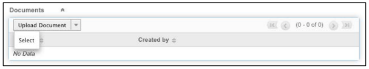

# [!DNL SugarCRM]  安装指南 {#sugarcrm-install-guide}

[联系客户关怀](https://adobe.com/go/adobesign-support-center_cn)

Adobe [!DNL EchoSign] for [!DNL SugarCRM]是一款领先的电子签名和Web约束解决方案，可在[!DNL SugarCRM]中为电子签名和传真签名提供电子签名自动化。 用户可以直接从SugarCRM发送合同，查看合同历史记录，并保存与关联帐户、联系人、报价等相关的电子签名合同。
适用于[!DNL SugarCRM]的Adobe[!DNL EchoSign]适用于所有受支持的SugarCRM版本，包括6.3 - 6.7适用于点播或内部部署解决方案。

本文档是[!DNL SugarCRM]管理员的指南，用于了解如何为[!DNL SugarCRM]插件安装和配置Adobe[!DNL EchoSign]。

## 安装此插件 {#install-plugin}

1. 从[SugarExchange列表](http://www.sugarexchange.com/product_details.php?product=1123)获取[!DNL SugarCRM]归档文件的Adobe[!DNL EchoSign]。
1. 使用您的管理员帐户登录[!DNL SugarCRM]。
1. 转到&#x200B;**[!UICONTROL 管理]** > **[!UICONTROL 模块加载器]**。

   

1. 要上传[!DNL SugarCRM]插件的Adobe[!DNL EchoSign]的归档文件，请选择&#x200B;**[!UICONTROL 浏览]**，然后选择归档文件，然后选择&#x200B;**[!UICONTROL 上载]**。
1. 上载归档文件后，选择&#x200B;**[!UICONTROL 安装]**&#x200B;开始安装。
1. 查看条款和条件，然后选择&#x200B;**[!UICONTROL 接受]** > **[!UICONTROL 提交]**。
1. 如果插件安装成功，进度栏将指示100%成功。  如果进度条未达到100%，请选择&#x200B;**[!UICONTROL 显示日志]**&#x200B;以查看SugarCRM遇到的错误。

   

1. 安装后，转到&#x200B;**[!UICONTROL 管理>修复]**&#x200B;并选择&#x200B;**[!UICONTROL 快速修复和重建]**。

>[!NOTE]
>
>如果要在[!DNL SugarCRM] OnDemand上安装插件，请将支持票证与[!DNL SugarCRM]一起提交，以暂时删除OnDemand的包检查器的限制，以便可以安装包。 这是标准流程的一部分。

## 升级插件 {#upgrade-plugin}

如果要将[!DNL SugarCRM]插件的Adobe[!DNL EchoSign]更新到更新版本，则应安装该插件，而不卸载以前的版本。
升级插件后，转到**[!UICONTROL 管理]** > **[!UICONTROL 修复]**&#x200B;并选择&#x200B;**[!UICONTROL 快速修复和重建]**。

**注意：** 如果卸载以前的插件，请不要在卸载期间删除表。否则，您可能丢失[!DNL EchoSign]协议数据。

## 配置插件 {#configure-plugin}

1. 如果您已经是Adobe[!DNL EchoSign]客户，请继续执行步骤2。

   如果您没有[!DNL EchoSign]帐户，请[注册14天免费试用版](https://sugarcrmintegration.echosign.com/public/login)，然后按照联机注册步骤启用Adobe[!DNL EchoSign]帐户。
1. 登录到[Echo Sign帐户](http://www.echosign.com)，然后执行以下步骤：
   1. 选择&#x200B;**[!UICONTROL 帐户]**&#x200B;选项卡。
   1. 选择左下角的&#x200B;**[!UICONTROL EchoSign API]**。
   1. 选择&#x200B;**[!UICONTROL 启用API访问]**&#x200B;并从页面获取您的API密钥。

   

1. 在SugarCRM中，转到&#x200B;**[!UICONTROL 管理]** > **[!UICONTROL Adobe EchoSign设置]**，并在标记为&#x200B;**[!UICONTROL EchoSign API密钥]**&#x200B;的字段中输入API密钥。
1. 或者，使用以下设置配置插件：

   1. 从报价创建协议时自动附加PDF:如果[!DNL SugarCRM]用户从“报价”模块创建EchoSign协议，请选择是否自动附加报价PDF。
   1. 管理收件人列表：在[!DNL EchoSign]协议模块的“收件人”子面板中选择显示哪些模块。 这也会向这些模块添加[!DNL EchoSign]协议子面板。
   1. 将发送按钮添加到以下模块：选择是否希望“创建[!DNL EchoSign]协议”按钮/操作包含在报价模块的主要操作中。
   1. 选择&#x200B;**[!UICONTROL 保存]**&#x200B;以存储设置。

**注意：** Adobe [!DNL EchoSign] for  [!DNL SugarCRM] plugin需要 [PHP SOAP扩展](http://www.php.net/manual/en/book.soap.php)。要启用SOAP支持，请使用enable-soap配置PHP。

## 获取协议更新（适用于[!DNL SugarCRM] 6.3或更高版本） {#get-agreement-updates}

对于6.3和更高版本，您可以使用以下两个选项获取协议更新。 在SugarCRM的早期版本中，默认情况下该插件仅提供回调方法（选项1）。

### 选项1:设置将更新推送到EchoSign的回调方法

如果网站是面向公共的，则每当发生新事件时，都可以让Adobe EchoSign ping您的[!DNL SugarCRM]实例。 [!DNL SugarCRM] 然后自动实时更新协议状态、事件并下载已签名的文档（如果已签名）。（如果您位于防火墙后，需要将[!DNL EchoSign]服务器IP地址列入白名单，或使用本指南下一节中介绍的更新EchoSign协议的计划作业方法）。

1. 转到&#x200B;**[!UICONTROL 管理]** > **[!UICONTROL Adobe EchoSign设置]**。
1. 选中复选框&#x200B;**[!UICONTROL 使用EchoSign回调方法]**&#x200B;可更新协议的事件和状态。
1. 选择&#x200B;**[!UICONTROL 保存]**。

### 选项2:为防火墙后的[!DNL SugarCRM]实例设置计划作业

[!DNL EchoSign] for [!DNL SugarCRM]插件还可以使用计划作业查询[!DNL EchoSign]的协议已发出进行签名的更新。 如果内部部署[!DNL SugarCRM]安装在防火墙后，则可以使用计划作业查询方法。

要设置：

1. 转到&#x200B;**[!UICONTROL 管理]** > **[!UICONTROL 调度程序]**。
1. 从选项卡下拉菜单中，选择&#x200B;**[!UICONTROL 创建调度程序]**。
1. 输入作业名称。
1. 对于“作业”字段，选择&#x200B;**[!UICONTROL Adobe EchoSign Status Updater]**。
1. 将作业设置为根据需要运行频率。 我们建议将其设置为每10分钟运行一次，这意味着在打开、阅读或签署协议后，[!DNL SugarCRM]可能需要10分钟才能更新该信息。

   **注意：** 如果您有大量协议需要签名，则频繁运行此操作可能会导致系统速度减慢。

   

1. 转到&#x200B;**[!UICONTROL 管理]** > **[!UICONTROL Adobe EchoSign设置]**。
1. 取消选中&#x200B;**[!UICONTROL 使用EchoSign回调方法]**&#x200B;框，可更新协议的事件和状态。
1. 选择&#x200B;**[!UICONTROL 保存]**。
注意：在[!DNL SugarCRM]中打开调度程序，以使其正常工作。

要将EchoSign协议添加到其他[!DNL SugarCRM]模块，请执行以下操作：

1. 转到&#x200B;**[!UICONTROL 管理]** > **[!UICONTROL Studio]**。
1. 从左列文件夹树中，选择添加[!DNL EchoSign]协议的模块。
1. 选择&#x200B;**[!UICONTROL 关系]**> **[!UICONTROL 添加关系]**。
1. 从下拉菜单中，选择“类型”作为“**[!UICONTROL 一到多]**”，选择“模块”作为“**[!UICONTROL EchoSign协议]**”。
1. 选择&#x200B;**[!UICONTROL 保存并部署]**。

   

   [!DNL EchoSign] 协议现在显示在模块中，可以在模块中创建和跟踪协议。

   

**其他配置步骤**

* **隐藏 [!DNL EchoSign] 模块**:通过转到“管理” [!DNL EchoSign] “显示模 [!DNL EchoSign] 块选项卡和子面板”并将它们移动到隐藏列，可以隐藏“收件人”和“事件”模块。
* **正在禁用packageScan**:如果您已在自己的系统上启用了packageScan，则需要在安装过程中禁用它。如果您正在使用[!DNL SugarCRM]点播，请联系[!DNL SugarCRM]支持人员以为您禁用packageScan。

## 卸载插件 {#uninstall-plugin}

1. 使用您的管理员帐户登录[!DNL SugarCRM]。
1. 转到&#x200B;**[!UICONTROL 管理]** > **[!UICONTROL 模块加载器]**。
1. 选择[!UICONTROL EchoSign for SugarCRM plugin]旁边的&#x200B;**[!UICONTROL 卸载]**。
1. 选择&#x200B;**[!UICONTROL 提交]**&#x200B;开始卸载。 也可以选择删除为插件创建的数据库表。

   

   如果插件卸载成功，进度栏将指示100%成功。 如果进度条未达到100%，请选择[!UICONTROL 显示日志]以查看SugarCRM遇到的错误。

   

## 对[!DNL SugarCRM]使用Adobe[!DNL EchoSign] {#use-echosign-for-sugarcrm}

您可以创建与帐户、联系人、报价或其他[!DNL SugarCRM]模块关联的Adobe[!DNL EchoSign]协议。 您可以附加文件、指定收件人和发送以请求签名。 Adobe [!DNL EchoSign]使用协议的当前状态更新[!DNL SugarCRM]，并在协议完全执行后将签名合同存储在[!DNL SugarCRM]中。

### 创建和编辑Adobe[!DNL EchoSign]协议 {#create-edit-agreements}

您可以通过[!DNL EchoSign]协议模块或通过由[!DNL SugarCRM]管理员配置的模块创建协议。

1. 从[!UICONTROL EchoSign协议]选项卡上的[!UICONTROL 操作]列表中，选择&#x200B;**[!UICONTROL 创建EchoSign协议]**。
1. 在[!DNL EchoSign]协议的主要部分中，输入以下信息或从各种协议选项中进行选择：

   1. **[!UICONTROL 名称：]** 输入协议的名称。
   1. **[!UICONTROL 签名类型：]** 选择文档接受的签名类型。这些选项包括电子签名和传真签名。
   1. **[!UICONTROL 我还需要签署本协议：指]** 明发件人是否还需要签署协议。
   1. **[!UICONTROL 签名顺序：]** 如果选中了上一个选项“我还需要签署此协议”，则还可以选择发件人和收件人签名的顺序。
   1. **[!UICONTROL 提醒收件人签名：选]** 择提醒收件人签名文档的频率。选项为“每日”或“每周”。
   1. **[!UICONTROL 截止签名日期的天]** 数：指定必须签署协议的天数。
   1. **[!UICONTROL 预览、定位签名或添加表单字]**  段：选择此选项可在发送协议之前预览协议，或在将签名字段、缩写签名字段或其他表单字段发送给收件人之前将其拖放到协议中。在您预览文档或将要放在文档中的字段拖动之后，请记住选择“发送”按钮以将协议发送给收件人。
   1. **[!UICONTROL 为第一位签名者托管签]** 名：指示发送者是否要托管亲临签名的协议。
      * **[!UICONTROL 消息：]** 包括收件人的消息。
      * **[!UICONTROL 帐户、业务机会、报价：]** 选择或修改与此协议关联的帐户、业务机会或报价。
      * **[!UICONTROL 语言：]** 指定向收件人显示签名页面和电子邮件通知时使用的语言。

      

1. 在[!UICONTROL EchoSign协议]的[!UICONTROL 安全选项]部分，输入以下信息：

   a)**[!UICONTROL 需要签名的密码：]**指示收件人在签署文档之前是否必须输入密码。
b)**[!UICONTROL 需要打开的密码：]**指示在收件人可以打开协议PDF或已签名协议之前是否必须输入密码
c)**[!UICONTROL 密码：]**指定用于签名或打开文档的密码。
d)**[!UICONTROL 确认密码：]**&#x200B;确认用于签名或打开文档的密码。

1. 在[!DNL EchoSign]协议的“其他”部分中，输入以下信息：

   a)**[!UICONTROL 用户：]**&#x200B;指定[!DNL SugarCRM]用户。 默认值是当前登录系统的用户。
b)**[!UICONTROL 团队：]**&#x200B;要更改主团队分配，请输入新主团队的名称。 要向记录分配其他团队，请单击&#x200B;**[!UICONTROL 选择]**&#x200B;并从团队列表中选择团队，或选择&#x200B;**[!UICONTROL 添加到]**&#x200B;以添加团队字段并输入团队名称。 有关详细信息，请参阅[!DNL SugarCRM]应用程序指南中的“将记录分配给用户和团队”。

1. 选择&#x200B;**[!UICONTROL 保存]**。

### [!DNL EchoSign] 协议详细信息视图 {#agreement-detail-view}

在保存[!DNL EchoSign]协议后，协议的详细视图包含以下子面板：

* **[!UICONTROL 收件人：]** 此子面板中列出的任何联系人都会收到在“文档”子面板中指定的文档。在发送协议之前，必须添加一个或多个收件人。
* **[!UICONTROL 文档：]** 上传新文档或选择已上传到中以发送 [!DNL SugarCRM] 以供签名的文档。
* **[!UICONTROL 事件：]** 有关协议的任何操作（如何时发送协议以请求签名、查看或签名）都列在此子面板中。要编辑[!DNL EchoSign]协议，请在协议的[!UICONTROL 详细视图]上选择“编辑]”按钮。[!UICONTROL 

**注意：** 在发送协议以请求签名后，“编  辑”按钮将从详细信息视图中删除，以保留事件记录。但是，您可以启用“编辑”按钮。 为此，请转到[!UICONTROL 管理员] > [!UICONTROL Adobe EchoSign设置]并取消选中选项&#x200B;*[!UICONTROL 在发送协议以请求签名后，禁用编辑或删除]*&#x200B;的功能。

### 将文档添加到[!DNL EchoSign]协议 {#add-document}

[!DNL SugarCRM] 用户可以上传新文档，或使用EchoSign协议记录的“文 [!DNL SugarCRM] 档”子面板选择已上载到的文档。要上传文档，请在[!UICONTROL Documents]子面板中选择&#x200B;**[!UICONTROL 上传文档]**。

有关该表单各个字段的详细信息，请参阅[!DNL SugarCRM]应用程序指南中的“文档模块”部分。

要选择文档，请单击“文档”子面板中的&#x200B;**[!UICONTROL “选择]**”。 有关如何管理子面板中相关信息的详细信息，请参阅[!DNL SugarCRM]应用程序指南中的“查看和管理记录信息”。

### 为[!DNL EchoSign]协议指定收件人 {#specify-recipient}

1. 从[!DNL EchoSign]协议的[!UICONTROL 收件人]子面板中，选择&#x200B;**[!UICONTROL 添加收件人]**。
1. 输入以下信息：
a)[!UICONTROL 收件人：]从下拉菜单中选择收件人类型。 在文本字段中键入收件人的姓名或电子邮件地址。 [!DNL SugarCRM] 在键入时查找名称并提供选择项列表。如果找到匹配项，请选择名称。 也可以选择箭头图标从弹出窗口中选择名称。 要从字段中抹除名称，请选择&#x200B;**[!UICONTROL X]**图标。
b)[!UICONTROL 角色：]从下拉菜单中选择角色。 这些选项包括签名者、抄送和审批人。 审批人不必签署文档。
1. 选择“保存”。

### 发送协议以供签名 {#send-for-signature}

当协议可以发送以请求签名时，请从页面左上角的下拉菜单中选择&#x200B;**[!UICONTROL Send for Signature]**。 收件人随后会收到一封电子邮件，通知他们等待其签名的文档。 收件人签名文档后，发送者将收到电子邮件通知。
如果选中了“为第一位签名者]托管签名”选项，则可以选择&#x200B;**[!UICONTROL Send for Signature]**&#x200B;以允许签名者与发件人一起签名文档。[!UICONTROL 

**[!UICONTROL 当前签名者的主机签名]**&#x200B;链接也显示在[!UICONTROL 第一个签名者的主机签名]字段旁边，在文档签名之前，可以访问该字段。 您可以使用此链接为多个签名者托管协议签名，或者在弹出窗口意外关闭时重新打开该窗口。
如果选中了“预览、定位签名或添加表单字段]”选项，请选择“Send for Signature ****”，以允许发送者在发送文档之前预览文档或将字段拖动到文档。 [!UICONTROL 必须在该窗口中选择&#x200B;**[!UICONTROL Send]**&#x200B;才能将协议发送给收件人。

图5:选择“Send for Signature”，将文档发送给收件人以请求签名。

### 从报价记录发送 {#send-from-quote-record}

Adobe[!DNL EchoSign]与[!DNL SugarCRM]中的报价直接集成，因此报价的PDF会自动生成并附加到协议记录。
查看报价时，选择**[!UICONTROL 创建EchoSign协议]**&#x200B;以生成报价并自动将其附加到协议。 新协议还会自动关联任何相关的业务机会、帐户或报价。

要关闭报价PDF自动附加到协议，请转到&#x200B;**[!UICONTROL 管理]** > **[!UICONTROL Adobe EchoSign设置]**，并取消选中&#x200B;*[!UICONTROL 从报价]*&#x200B;创建协议时自动附加PDF框。

### 取消协议 {#cancel-agreement}

如果所有收件人尚未签名文档，则在发送[!DNL EchoSign]协议以请求签名后，您可以取消该协议。 在发送文档以请求签名后，协议的“详细信息”视图中会显示[!UICONTROL 取消协议]按钮。 选择&#x200B;**[!UICONTROL 取消协议]**&#x200B;以取消协议。

注意：如果[!DNL EchoSign]协议已发送以请求签名，而记录已被删除，则您必须在删除协议之前取消该协议。

### 跟踪签名 {#track-signatures}

[!DNL EchoSign]协议的[!UICONTROL 事件]子面板跟踪发送以请求签名的协议的状态。 要查看[!DNL EchoSign]协议的最新更新，请选择&#x200B;**[!UICONTROL 更新状态]**。 [!UICONTROL 更新状态]按钮仅在发送协议以请求签名后才可用。

### 发送提醒 {#send-reminders}

要在发送协议后向当前签名者发送提醒，请选择&#x200B;**[!UICONTROL 发送提醒]**。 它会立即向当前签名者发送电子邮件提醒，告知正在等待签名的协议。

