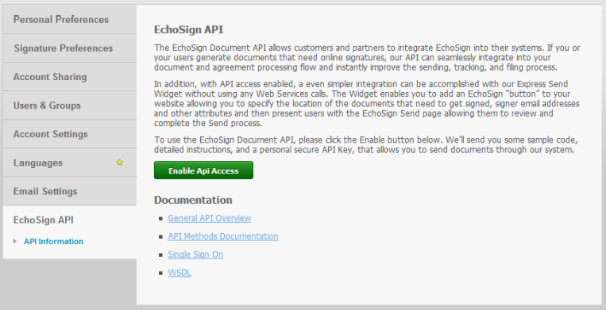
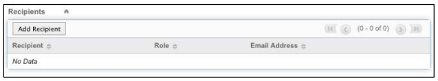

# [!DNL SugarCRM] 安装指南 {#sugarcrm-install-guide}

[联系客户关怀部门](https://adobe.com/go/adobesign-support-center)

Adobe [!DNL EchoSign] 用于 [!DNL SugarCRM] 是一款领先的电子签名和Web合约解决方案，可在各种电子签名解决方案中 [!DNL SugarCRM] 用于电子签名和传真签名。 用户可以直接从SugarCRM发送合同、查看合同历史记录，还可以将电子签名的合同与关联帐户、联系人、报价等一起保存。
Adobe [!DNL EchoSign] 用于 [!DNL SugarCRM] 适用于所有支持的SugarCRM版本，包括6.3 - 6.7的按需或本地解决方案。

本文档是针对 [!DNL SugarCRM] 管理员了解如何安装和配置Adobe [!DNL EchoSign] 用于 [!DNL SugarCRM] 插件。

## 安装此插件 {#install-plugin}

1. 获取Adobe [!DNL EchoSign] 用于 [!DNL SugarCRM]  存档文件 [SugarExchange列表](http://www.sugarexchange.com/product_details.php?product=1123)的
1. 登录 [!DNL SugarCRM] 使用您的管理员帐户。
1. 转到 **[!UICONTROL 管理]** > **[!UICONTROL 模块加载器]**&#x200B;的

   

1. 要上传Adobe的存档文件 [!DNL EchoSign] 用于 [!DNL SugarCRM] 插件，选择 **[!UICONTROL 浏览]**，然后选择归档文件，然后选择 **[!UICONTROL 上传]**&#x200B;的
1. 上传存档文件后，选择 **[!UICONTROL 安装]** 以开始安装。
1. 查看条款和条件，然后选择 **[!UICONTROL 接受]** > **[!UICONTROL 提交]**&#x200B;的
1. 如果插件安装成功，则进度条指示100%成功。  如果进度条未达到100%，请选择 **[!UICONTROL 显示日志]** 查看SugarCRM遇到的错误。

   

1. 安装后，转到 **[!UICONTROL 管理>修复]** 并选择 **[!UICONTROL 快速修复和重建]**&#x200B;的

>[!NOTE]
>
>如果要将插件安装在 [!DNL SugarCRM] OnDemand，使用 [!DNL SugarCRM] 临时删除OnDemand包检查器的限制，以便可以安装包。 这是标准流程的一部分。

## 升级插件 {#upgrade-plugin}

如果您要更新Adobe [!DNL EchoSign] 用于 [!DNL SugarCRM] 增效工具更新到较新版本，则无需卸载早期版本即可安装增效工具。
升级插件后，转到 **[!UICONTROL 管理]** > **[!UICONTROL 修复]** 然后选择 **[!UICONTROL 快速修复和重建]**&#x200B;的

**注意：** 如果您卸载以前的插件，请不要在卸载过程中删除表。 否则，您可能会丢失 [!DNL EchoSign] 协议数据。

## 配置插件 {#configure-plugin}

1. 如果您已经是Adobe [!DNL EchoSign] 继续步骤2。

   如果您没有 [!DNL EchoSign] 帐户， [注册14天免费试用版](https://sugarcrmintegration.echosign.com/public/login) 并按照在线注册步骤启用您的Adobe [!DNL EchoSign] 帐户。
1. 登录到 [Echo Sign帐户](http://www.echosign.com) 并按照以下步骤操作：
   1. 选择 **[!UICONTROL 帐户]** 选项卡。
   1. 选择 **[!UICONTROL EchoSign API]** 左下角。
   1. 选择 **[!UICONTROL 启用API访问]** 并从页面获取您的API密钥。

   

1. 在SugarCRM中，转到 **[!UICONTROL 管理]** > **[!UICONTROL Adobe EchoSign Settings]** 并在标记为API的字段中输入API密钥 **[!UICONTROL EchoSign API密钥]**&#x200B;的
1. （可选）使用以下设置配置插件：

   1. 从报价创建PDF时自动附加报价：选择是否自动附加PDF报价，如果 [!DNL SugarCRM] 用户从“报价”模块创建EchoSign协议。
   1. 管理收件人列表：选择在 [!DNL EchoSign] “协议”模块。 这还会将 [!DNL EchoSign] 这些模块的协议子面板。
   1. 将“发送”按钮添加到这些模块中：如果您希望创建 [!DNL EchoSign] 要包含在报价模块的主要操作中的协议按钮/操作。
   1. 选择 **[!UICONTROL 保存]** 以存储您的设置。

**注意：** Adobe [!DNL EchoSign] 用于 [!DNL SugarCRM] 插件需要 [PHP SOAP扩展](http://www.php.net/manual/en/book.soap.php)的 要启用SOAP支持，请使用enable-soap配置PHP。

## 获取协议更新(适用于 [!DNL SugarCRM] 版本6.3或更高版本) {#get-agreement-updates}

对于版本6.3及更高版本，您可以使用以下两个选项来获取协议更新。 在以前版本的SugarCRM中，增效工具默认情况下仅提供回调方法（选项1）。

### 选项1:设置将更新推送到EchoSign的回调方法

如果您的网站面向公众，则可以让Adobe EchoSign ping [!DNL SugarCRM] 实例。 [!DNL SugarCRM] 然后自动并实时更新协议状态、事件并下载已签名的文档（如果已签名）。 (如果您位于防火墙之后，则需要将 [!DNL EchoSign] 服务器IP地址或使用本指南下一部分中介绍的更新EchoSign协议的计划作业方法)。

1. 转到 **[!UICONTROL 管理]** > **[!UICONTROL Adobe EchoSign Settings]**&#x200B;的
1. 选中复选框 **[!UICONTROL 使用EchoSign回调方法]** 更新协议的事件和状态。
1. 选择 **[!UICONTROL 保存]**&#x200B;的

### 选项2:为设置计划作业 [!DNL SugarCRM] 防火墙后的实例

在 [!DNL EchoSign] 用于 [!DNL SugarCRM] 插件也可以使用计划作业进行查询 [!DNL EchoSign] 以获取已发出进行签名的协议更新。 如果您有内部部署，则可以使用调度的作业查询方法 [!DNL SugarCRM] 安装位于防火墙之后。

要设置，请执行以下操作：

1. 转到 **[!UICONTROL 管理]** > **[!UICONTROL 计划程序]**&#x200B;的
1. 从选项卡下拉菜单中，选择 **[!UICONTROL 创建计划程序]**&#x200B;的
1. 输入作业名称。
1. 对于“作业”字段，选择 **[!UICONTROL Adobe EchoSign Status Updater]**&#x200B;的
1. 根据需要将作业设置为频繁运行。 我们建议将其设置为每10分钟运行一次，这意味着在打开、阅读或签署协议后，可能需要最多10分钟才能完成 [!DNL SugarCRM] 将用这些信息进行更新。

   **注意：** 如果您有大量协议发出进行签名，则过于频繁地运行此协议，可能会导致系统速度减慢。

   

1. 转到 **[!UICONTROL 管理]** > **[!UICONTROL Adobe EchoSign Settings]**&#x200B;的
1. 取消选中此框 **[!UICONTROL 使用EchoSign回调方法]** 更新协议的事件和状态。
1. 选择 **[!UICONTROL 保存]**的
注意：打开日程安排程序 [!DNL SugarCRM] 这样才能成功。

要将EchoSign协议添加到其他协议，请执行以下操作 [!DNL SugarCRM] 模块：

1. 转到 **[!UICONTROL 管理]** > **[!UICONTROL Studio]**&#x200B;的
1. 从左侧列文件夹树中，选择要添加的模块 [!DNL EchoSign] 协议。
1. 选择 **[!UICONTROL 关系]**> **[!UICONTROL 添加关系]**&#x200B;的
1. 从下拉菜单中，选择“键入为” **[!UICONTROL 一对多]** 模块作为 **[!UICONTROL EchoSign协议]**&#x200B;的
1. 选择 **[!UICONTROL 保存和部署]**&#x200B;的

   

   [!DNL EchoSign] 协议现在显示在模块中，可以在此处创建和跟踪协议。

   

**其他配置步骤**

* **隐藏 [!DNL EchoSign] 模块**:您可以隐藏 [!DNL EchoSign] 收件人 [!DNL EchoSign] 事件模块：转到管理“显示模块选项卡和子面板”，并将其移动到隐藏列。
* **禁用packageScan**:如果您已经在自己的系统上启用了packageScan，则需要在安装期间将其禁用。 如果您使用的是 [!DNL SugarCRM] 按需，联系 [!DNL SugarCRM] 支持为您禁用packageScan。

## 卸载插件 {#uninstall-plugin}

1. 登录 [!DNL SugarCRM] 使用您的管理员帐户。
1. 转到 **[!UICONTROL 管理]** > **[!UICONTROL 模块加载器]**&#x200B;的
1. 选择 **[!UICONTROL 卸载]** (位于 [!UICONTROL EchoSign for SugarCRM增效工具]的
1. 选择 **[!UICONTROL 提交]** 以开始卸载。 您还可以选择删除为插件创建的数据库表。

   

   如果插件卸载成功，进度条指示100%成功。 如果进度条未达到100%，请选择 [!UICONTROL 显示日志] 查看SugarCRM遇到的错误。

   

## 使用Adobe [!DNL EchoSign] 用于 [!DNL SugarCRM] {#use-echosign-for-sugarcrm}

您可以创建Adobe [!DNL EchoSign] 与帐户、联系人、报价或其他联系人关联的协议 [!DNL SugarCRM] 模块。 您可以附加文件、指定收件人，以及发送以请求签名。 Adobe [!DNL EchoSign] 更新 [!DNL SugarCRM] 保存已签名的合同 [!DNL SugarCRM] 一旦完全执行。

### 创建和编辑Adobe [!DNL EchoSign] 协议 {#create-edit-agreements}

您可以通过 [!DNL EchoSign] “协议”模块或通过 [!DNL SugarCRM] 管理员。

1. 从 [!UICONTROL 动作] 列表 [!UICONTROL EchoSign协议] 选项卡，选择 **[!UICONTROL 创建EchoSign协议]**&#x200B;的
1. 在 [!DNL EchoSign] 协议，输入以下信息，或从各种协议选项中进行选择：

   1. **[!UICONTROL 名称：]** 输入协议名称。
   1. **[!UICONTROL 签名类型：]** 选择文档接受的签名类型。 选项包括“电子签名”和“传真签名”。
   1. **[!UICONTROL 我还需要签署本协议：]** 指示发件人是否还需要签署协议。
   1. **[!UICONTROL 签名顺序：]** 如果选中了上面的选项“我还需要签署此协议”，还需选择发件人和收件人签名的顺序。
   1. **[!UICONTROL 提醒收件人签名：]** 选择提醒收件人签署文档的频率。 选项为“每天”或“每周”。
   1. **[!UICONTROL 距离签名截止日期的天数：]** 指定必须签署协议的天数。
   1. **[!UICONTROL 预览、定位签名或添加表单字段：]**  选择此选项可在发送协议之前预览协议，或者先将签名字段、缩写签名字段或其他表单字段拖放到协议中，然后再将其发送给收件人。 在预览文档或将所需字段拖动到文档后，请记住选择发送按钮以将协议发送给收件人。
   1. **[!UICONTROL 第一位签名者的托管签名：]** 指示发件人是否要亲自托管协议签名。
      * **[!UICONTROL 消息：]** 包括给收件人的消息。
      * **[!UICONTROL 客户、业务机会、报价：]** 选择或修改与此协议关联的帐户、业务机会或报价。
      * **[!UICONTROL 语言：]** 指定向收件人显示签名页面和电子邮件通知时使用的语言。

      

1. 在 [!UICONTROL 安全性选项] 部分 [!UICONTROL EchoSign协议]，请输入以下信息：

   a) **[!UICONTROL 签名所需的密码：]** 指示在收件人可以签名文档之前是否必须输入密码。
b) **[!UICONTROL 打开所需的密码：]** 指示在收件人可以打开协议或签名协议的PDF之前是否必须输入密码(c) **[!UICONTROL 密码：]** 指定用于签名或打开文档的口令。
d) **[!UICONTROL 确认密码：]** 确认用于签名或打开文档的密码。

1. 在 [!DNL EchoSign] 协议，请输入以下信息：

   a) **[!UICONTROL 用户：]** 指定 [!DNL SugarCRM] 用户。 默认值为当前登录到系统的用户。
b) **[!UICONTROL 团队：]** 要更改主要团队分配，请输入新主要团队的名称。 要将其他团队分配给记录，请单击 **[!UICONTROL 选择]** 并从“团队列表”中选择一个团队，或选择 **[!UICONTROL 添加到]** 添加团队字段并输入团队名称。 有关更多信息，请参阅 [!DNL SugarCRM] 应用程序指南。

1. 选择 **[!UICONTROL 保存]**&#x200B;的

### [!DNL EchoSign] 协议详细信息视图 {#agreement-detail-view}

在 [!DNL EchoSign] 协议已保存，协议的详细信息视图包含以下子面板：

* **[!UICONTROL 收件人：]** 此子面板中列出的任何联系人均会收到在“文档”子面板中指定的文档。 在发送协议之前，您必须添加一个或多个收件人。
* **[!UICONTROL 文档：]** 上载新文档或选择已上载到的文档 [!DNL SugarCRM] 发送以请求签名。
* **[!UICONTROL 事件：]** 有关此协议的任何操作（例如，何时发送协议以请求签名、查看协议或已签署协议）都会列在此子面板中。
要编辑 [!DNL EchoSign] “协议”，请选择 [!UICONTROL 编辑] 按钮 [!UICONTROL 详细视图] 协议。

**注意：** 在发送协议以请求签名后， [!UICONTROL 编辑] 按钮将从详细信息视图中删除，以便保留事件记录。 但是，您可以启用“编辑”按钮。 为此，请转到 [!UICONTROL 管理员] > [!UICONTROL Adobe EchoSign Settings] 并取消选中该选项 *[!UICONTROL 在发送协议以请求签名后，禁用编辑或删除功能]*&#x200B;的

### 将文档添加到 [!DNL EchoSign] 协议 {#add-document}

[!DNL SugarCRM] 用户可以上传新文档或选择已上传到 [!DNL SugarCRM] 使用EchoSign协议记录的“文档”子面板。
要上传文档，请选择 **[!UICONTROL 上载文档]** 的 [!UICONTROL 文档] 子面板。

请参阅的“文档模块”部分 [!DNL SugarCRM] Application Guide（了解有关该表单各个字段的详细信息）。

要选择文档，请单击 **[!UICONTROL 选择]** 文档。 请参阅 [!DNL SugarCRM] Application Guide，了解有关如何管理子面板中的相关信息的详细信息。

### 为字段指定收件人 [!DNL EchoSign] 协议 {#specify-recipient}

1. 从 [!UICONTROL 收件人] 子面板 [!DNL EchoSign] “协议”，选择 **[!UICONTROL 添加收件人]**&#x200B;的
1. 输入以下信息：a) [!UICONTROL 收件人：] 从下拉菜单中选择收件人类型。 在文本字段中键入收件人的姓名或电子邮件地址。 [!DNL SugarCRM] 在您键入时查找名称并提供选择列表。 如果找到匹配项，请选择一个名称。 您也可以选择箭头图标，从弹出窗口中选择一个名称。 要从字段中擦除名称，请选择 **[!UICONTROL X]** 图标。
b) [!UICONTROL 角色：] 从下拉菜单中选择角色。 这些选项包括“签名者”、“抄送”和“审批者”。 审批人无需签署文档。
1. 选择“保存”。

### 发送协议以供签名 {#send-for-signature}

当准备好发送协议以请求签名时，选择 **[!UICONTROL Send for Signature]** 页面左上角的下拉菜单中。 收件人随后会收到一封电子邮件，通知他们等待其签名的文档。 收件人签署文档后，发件人将收到一封电子邮件通知。
如果 [!UICONTROL 托管第一位签名者的签名] 选项，您可以选择 **[!UICONTROL Send for Signature]** 允许签名者在发件人在文档上进行签名。

A **[!UICONTROL 托管当前签名者的签名]** 链接也会显示在 [!UICONTROL 托管第一位签名者的签名] 字段，在签名文档之前可以访问。 您可以使用此链接托管多个签名者的协议签名，或者，如果弹出窗口意外关闭，可以重新打开该窗口。
如果 [!UICONTROL 预览、定位签名或添加表单字段] 选项，请选择 **[!UICONTROL Send for Signature]** 允许发送者在发送文档之前预览文档，或将字段拖放到文档中。 您必须选择 **[!UICONTROL 发送]** 以便将协议发送给接收者。

图5:选择Send for Signature以将文档发送给收件人进行签名。

### 从报价记录发送 {#send-from-quote-record}

Adobe [!DNL EchoSign] 直接集成了报价 [!DNL SugarCRM] 这样，报价PDF会自动生成，并附加到协议记录。
查看报价时，选择 **[!UICONTROL 创建EchoSign协议]** 生成报价并将其自动附加到协议。 新的协议还会自动关联任何相关的Opportunity 、 Account或Quote。

要关闭将报价PDF自动附加到协议的功能，请转到 **[!UICONTROL 管理]** > **[!UICONTROL Adobe EchoSign Settings]**，然后取消选中复选框 *[!UICONTROL 从报价创建PDF时自动附加报价]*&#x200B;的

### 取消协议 {#cancel-agreement}

您可以取消 [!DNL EchoSign] 在发送协议以请求签名后，如果所有收件人尚未签署文档，则协议将会失效。 A [!UICONTROL 取消协议] 在发送文档以供签名后，该按钮会显示在协议的“详细信息”视图中。 选择 **[!UICONTROL 取消协议]** 以取消协议。

注意：如果 [!DNL EchoSign] 发送协议以请求签名并删除记录，您必须在删除协议之前取消协议。

### 跟踪签名 {#track-signatures}

在 [!UICONTROL 事件] 子面板 [!DNL EchoSign] 协议将跟踪发送以供签名的协议的状态。 要查看 [!DNL EchoSign] “协议”，选择 **[!UICONTROL 更新状态]**&#x200B;的 在 [!UICONTROL 更新状态] 只有在发送协议以请求签名后，按钮才可用。

在发送协议以请求签名后，选择 **[!UICONTROL 更新状态]** 以检索最新状态。

### 发送提醒 {#send-reminders}

要在发送协议后向当前签名者发送提醒，请选择 **[!UICONTROL 发送提醒]**&#x200B;的 这会立即向当前签名者发送一封电子邮件提醒，告知其正在等待签名的协议。

