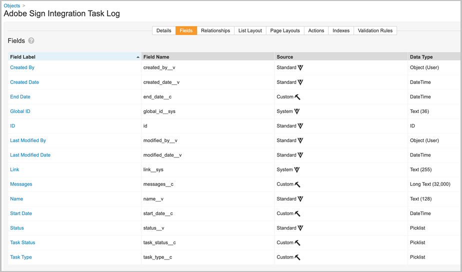
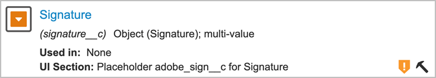
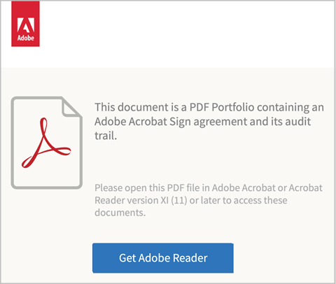
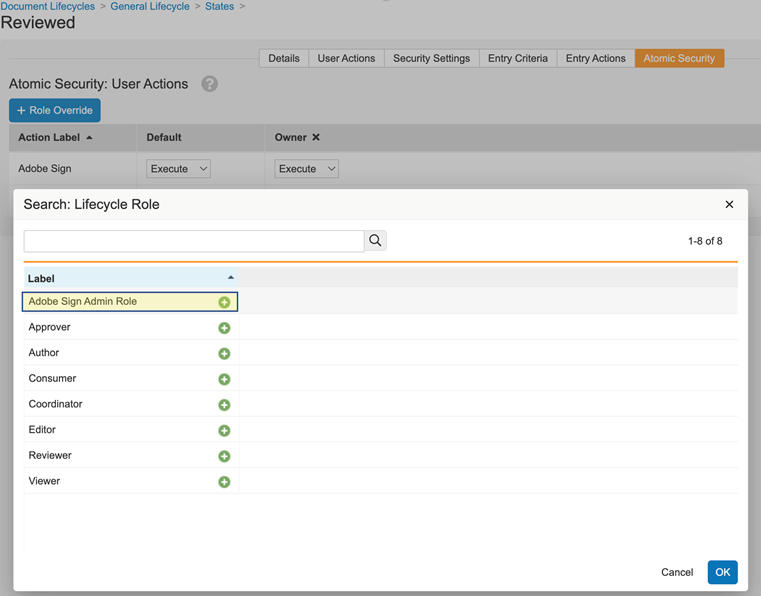
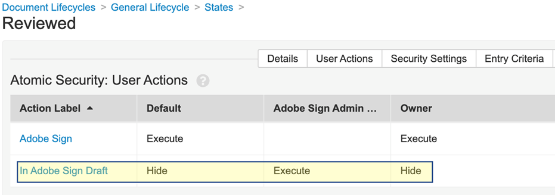
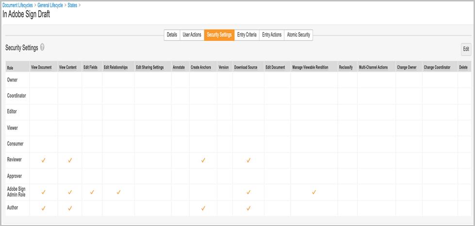
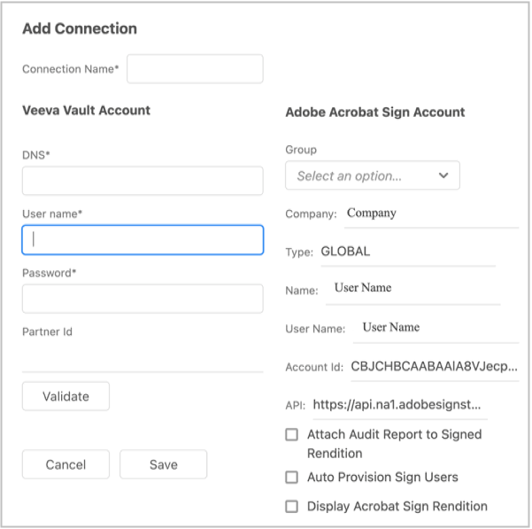
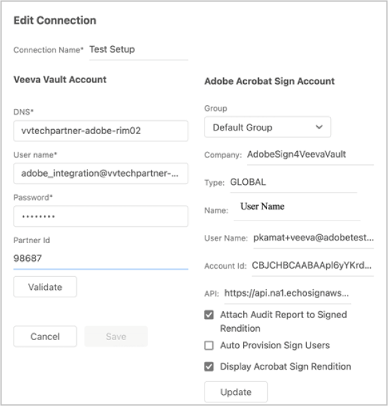

# [!DNL Veeva Vault] 安装指南{#veeva-installation-guide}

[**联系Adobe Acrobat Sign支持**](https://adobe.com/go/adobesign-support-center)

## 概述 {#overview}

本文档介绍如何将Adobe Acrobat Sign与 [!DNL Veeva Vault] 平台。 [!DNL Veeva Vault] 是一个为生命科学而构建的企业内容管理(ECM)平台。 “存储库”是一个内容和数据存储库，通常用于法规归档、研究报告、授权应用程序、总承包等。 单个企业可以有多个必须单独维护的“保管库”。

完成集成的高级步骤包括：

* 在Adobe Acrobat Sign中激活您的管理帐户（仅限新客户）。
* 在Vault中创建对象以跟踪协议生命周期的历史记录。
* 创建新的安全性配置文件。
* 在Adobe Acrobat Sign中配置组以容纳 [!DNL Veeva Vault] 集成用户。
* 创建文档字段和演绎版。
* 配置Web操作并更新文档生命周期。
* 创建文档类型用户和用户角色设置。
* 使用中间件将Veeva Vault连接到Adobe Acrobat Sign。

>[!NOTE]
>
>Adobe Sign管理员必须在Adobe Acrobat Sign中执行Adobe Acrobat Sign设置步骤。

## 配置 [!DNL Veeva Vault] {#configure-veeva}

要配置 [!DNL Veeva Vault] 要与Adobe Acrobat Sign集成，您必须实施下面列出的步骤。

### 步骤1. 创建组 {#create-group}

要为 [!DNL Vault]，一个新组名为 *Adobe Sign Admin Group* 的条目。 此组用于为Adobe Acrobat Sign相关字段设置文档字段级别安全性，并应包括 *Adobe Sign集成配置文件* 默认情况下。

### 步骤2. 部署包 {#deploy-package}

[部署包](https://helpx.adobe.com/content/dam/help/en/sign-integrations-new/veeva-vault/PKG-AdobeSign-Integration-Veeva.zip) 然后按照步骤操作。 部署后，程序包将创建：

* 自定义对象：签名对象、签名者对象、签名事件对象、处理保险箱对象
* 签名对象页面布局
* 签名事件对象页面布局
* 签名者对象页面布局
* Process Locker对象页面布局
* Adobe Sign集成任务日志对象页面布局
* Adobe Sign Rendition type
* 原始格式副本类型
* 共享字段签名__c
* Adobe Sign Web操作
* 取消Adobe Sign Web操作
* Adobe Sign管理员操作权限集
* Adobe Sign Integration Profile安全配置文件
* 应用程序角色Adobe Sign管理员角色
* 文档类型组“Adobe Sign Document”
* Adobe Sign集成任务日志对象

#### 签名对象 {#signature-object}

创建签名对象以存储与协议相关的信息。 签名对象是一个数据库，它包含以下特定字段下的信息：

**签名对象字段**

| 字段 | 标签 | 文字 | 说明 |
|:---|:---|:---|:------- | 
| external_id__c | 协议ID | 字符串(100) | 保留Adobe Acrobat Sign的唯一协议ID |
| file_hash__c | 文件哈希 | 字符串(50) | 保存已发送到Adobe Acrobat Sign的文件的md5校验和 |
| name__v | 名称 | 字符串(128) | 保留协议名称 |
| sender__c | 发件人 | 对象（用户） | 保留对创建协议的存储库用户的引用 |
| signature_status__c | 签名状态 | 字符串(75) | 保留协议在Adobe Acrobat Sign中的状态 |
| signature_type__c | 签名类型 | 字符串(20) | 在Adobe Acrobat Sign（书面或ESIGN）中保留协议的签名类型 |
| start_date__c | 开始日期 | 日期时间 | 发送协议以请求签名的日期 |
| cancellation_date__c | 取消日期 | 日期时间 | 保留取消协议的日期。 |
| completion_date__c | 完成日期 | 日期时间 | 保留协议完成的日期。 |
| viewable_rendition_used__c | 已使用可查看的呈现形式 | 布尔值 | 指示是否已发送可查看的呈现形式以进行签名的标记。 （默认情况下为true） |
| plugin_version__c | 插件版本 | 文本(10) | 它用于允许在部署新版本4.0之前正确处理创建的所有协议。 注意：部署4.0自定义Web应用程序版本后，每次创建签名记录时，此字段将设置为4.0。 |
| external_environment__c | 外部环境 | 文本(20) | 保留创建协议时使用的Adobe Sign环境名称。 |

#### 签署人对象 {#signatory-object}

创建签名者对象以存储与协议中的参与者相关的信息。 它包含以下特定字段下的信息：

**签名者对象字段**

| 字段 | 标签 | 文字 | 说明 |
|:---|:---|:---|:------- | 
| email__c | 电子邮件 | 字符串(120) | 保留Adobe Acrobat Sign的唯一协议ID |
| external_id__c | 参与者Id | 字符串(80) | 保留Adobe Acrobat Sign唯一参与者的标识符 |
| name__v | 名称 | 字符串(128) | 包含Adobe Acrobat Sign参与者的姓名 |
| order__c | 订单 | 数字 | 保留Adobe Acrobat Sign协议参与人的订单编号 |
| role__c | 角色 | 字符串(30) | 持有Adobe Acrobat Sign协议参与者的角色 |
| signature__c | 签名 | 对象（签名） | 保留对签名父记录的引用 |
| signature_status__c | 签名状态 | 字符串(100) | 保留Adobe Acrobat Sign协议参与人的状态 |
| user__c | 用户 | 对象（用户） | 如果参与者是保管库用户，则保存对签名人用户记录的引用 |

#### 签名事件对象 {#signature-event}

创建签名事件对象是为了存储与协议事件相关的信息。 它包含以下特定字段下的信息：

签名事件对象字段

| 字段 | 标签 | 文字 | 说明 |
|:---|:---|:---|:-------- | 
| acting_user_email__c | 代理用户电子邮件 | 字符串 | 保留执行导致生成事件的操作的Adobe Acrobat Sign用户的电子邮件 |
| acting_user_name__c | 代理用户名 | 字符串 | 保留执行导致生成事件的操作的Adobe Acrobat Sign用户的名称 |
| description__c | 说明 | 字符串 | 包含Adobe Acrobat Sign事件的描述 |
| event_date__c | 事件日期 | 日期时间 | 保存Adobe Acrobat Sign事件的日期和时间 |
| event_type__c | 事件类型 | 字符串 | 保留Adobe Acrobat Sign事件的类型 |
| name__v | 名称 | 字符串 | 自动生成的事件名称 |
| participant_comment__c | 参与者注释 | 字符串 | 包含Adobe Acrobat Sign参与人的注释（如果有） |
| participant_email__c | 参与者电子邮件 | 字符串 | 保留Adobe Acrobat Sign参与人的电子邮件 |
| participant_role__c | 参与者角色 | 字符串 | 具有Adobe Acrobat Sign参与者的角色 |
| signature__c | 签名 | 对象（签名） | 保留对签名父记录的引用 |
| external_id__c | 外部ID | 文本(200) | 暂挂由Adobe Sign生成的协议事件标识符。 |

#### Process Locker对象 {#process-locker}

将创建进程锁存器对象以锁定Adobe Acrobat Sign集成进程。 它不需要任何自定义字段。

#### Adobe Sign集成任务日志对象 {#task-log}

创建Adobe Sign集成任务日志(as_int_task_log__c)。 它是用于跟踪AgreementsEventsSynchronizerJob和AgreementsEventsProcessingJob执行情况的高容量对象。
AgreementsEventsSynchronizerJob:此任务可确保Adobe Sign中所有缺失的协议事件作为活动签名事件创建在Vault中，以供过去N天内Vault中创建的所有签名使用。
AgreementsEventsProcessingJob:此任务可确保处理所有具有活动签名事件记录的文档，具体取决于事件类型。

Adobe Sign集成任务日志对象字段

| 字段 | 标签 | 文字 | 说明 |
|:--|:--|:--|:---------| 
| start_date__c | 开始日期 | 日期时间 | 任务开始日期 |
| end_date__c | 结束日期 | 日期时间 | 任务结束日期 |
| task_status__c | 任务状态 | 选择列表 | 暂挂任务状态：   已完成(task_completed__c)完成但出现错误(task_completed_with_errors__c)失败(task_failed__c) |
| task_type__c | 任务类型 | 选择列表 | 暂挂任务类型：    协议事件同步(agreements_events_synchronization__c)协议事件处理(agreements_events_processing__c) |
| 消息__c | 消息 | 长市(32000) | 保留任务消息 |

作为部署包一部分的“签名”、“签名事件”、“进程保险箱”和“任务日志”对象默认启用“此对象的审核数据更改”属性。

**注意：** 通过启用“审核数据更改”设置，可以使Vault捕获对象在审核日志中记录数据更改。 默认情况下，此设置处于关闭状态。 启用此设置并创建记录后，便无法再禁用它。 如果关闭此设置且记录存在，则只有Vault所有者才能更新设置。

#### **显示签名对象的参与者和历史记录** {#display-participants-history}

作为部署包的一部分提供的“签名”对象随 [签名详细信息页面布局](https://vvtechpartner-adobe-rim.veevavault.com/ui/#admin/content_setup/object_schema/pagelayout?t=signature__c&amp;d=signature_detail_page_layout__c)的 “页面布局”中包含“参与者”和“历史记录”部分。

* 在 *参与者* 章节的“相关对象”部分已如下图所示进行配置。

   

* 您可以编辑将为参与者显示的列，如下所示。

   

* 在 *历史记录* 章节的“相关对象”部分已如下图所示进行配置。

   

* 您可以编辑为“历史记录”显示的列，如下所示。

   

#### **查看Adobe Acrobat Sign文档的参与者和审核历史记录** {#view-participants-audit-history}

* 要查看Adobe Acrobat Sign文档的参与者和审核历史记录，请选择文档“Adobe签名”部分中的链接。

   

* 打开的页面将显示Adobe Acrobat Sign文档的参与者和历史记录，如下所示。

   

* 查看签名的审核记录，如下所示。

   

### 步骤3. 设置安全性配置文件 {#security-profiles}

在步骤2中成功部署包将创建Adobe Sign集成配置文件。 Adobe Sign集成配置文件被分配给系统帐户，并由集成在调用Vault API时使用。 此配置文件允许具有以下权限：

* Vault API
* 阅读、创建、编辑和删除：签名、签名者、签名事件和处理保险箱对象

您必须通过将包含的安全配置文件设置为Adobe Sign集成配置文件来更新Adobe Sign管理员组（在步骤1中创建），如下图所示。

### 步骤4. 创建用户 {#create-user}

Adobe Acrobat Sign集成的Vault系统帐户用户必须：

* 拥有Adobe Sign集成配置文件
* 拥有安全配置文件
* 具有禁用密码过期的特定安全策略
* 成为Adobe Sign Admin Group的成员。

为此，请执行以下步骤：

1. 创建Adobe Acrobat Sign集成的Vault系统帐户用户。

   

2. 将用户添加到Adobe Sign Admin Group。

   

### 步骤5. 配置文档类型组 {#create-document-type-group}

部署Adobe Acrobat Sign包时，它会创建名为“Adobe Sign文档”的文档类型组记录。

您必须为适用于Adobe Acrobat Sign流程的所有文档分类添加此文档类型组。 由于文档类型组属性既不是从类型继承到子类型，也不是从子类型继承到分类级别，因此必须为符合Adobe Acrobat Sign条件的每个文档分类设置该属性。

**注意：** 如果用户角色设置对象不包含引用文档类型组对象的字段，则必须添加该字段。 为此，请转到 **[!UICONTROL 对象]** > **[!UICONTROL 用户角色设置]** > **[!UICONTROL 字段]** 并完成所需的步骤，如下图所示。

### 步骤6. 创建用户角色设置 {#create-user-role-setup}

正确配置生命周期后，系统应确保DAC为适用于Adobe Sign进程的所有文档添加Adobe Acrobat Sign管理员用户。 为此，请创建相应的用户角色设置记录，其中指定：

* 文档类型组作为Adobe Sign文档
* 作为Adobe Sign管理员角色的应用程序角色
* 集成用户

### 步骤7. 设置文档字段 {#create-fields}

包部署将创建以下新的共享文档字段，这些字段是建立集成所必需的：

* 签名(签名__c)

要设置文档字段，请执行以下操作：

1. 转到“配置”选项卡并选择 **[!UICONTROL 文档字段]** > **[!UICONTROL 共享字段]**&#x200B;的
1. 在“显示区段”字段中，选择 **[!UICONTROL 创建显示部分]** 和分配 **[!UICONTROL Adobe签名]** 作为章节标签。

   

1. 对于共享文档字段(签名__c)，请用以下参数更新UI部分 **[!UICONTROL Adobe签名]** 作为章节标签。
1. 将这两个共享字段添加到有资格使用Adobe Acrobat签名的所有文档类型中。 为此，请在基础文档页面中选择 **[!UICONTROL 添加]** > **[!UICONTROL 现有共享字段]** （位于右上角）。

   

   

   

1. 这两个字段必须具有仅允许Adobe Sign管理员组成员更新其值的特定安全性。

   

“禁用电子仓库叠加”(disable_vault_overlays__v)是现有的共享字段。 或者，该字段可以具有特定的安全性，该安全性仅允许Adobe Sign管理员组的成员更新其值。

### 步骤8. 声明文档演绎版 {#declare-renditions}

新的格式副本类型称为 *Adobe Sign Rendition(adobe_sign_rendition__c)* 由Vault集成用于将已签名的PDF文档上传到Adobe Acrobat Sign。 您必须为每个文档类型声明Adobe Sign格式副本，才有资格获得Adobe Acrobat签名。

新的格式副本类型称为 *原始格式副本* (original_rendition__c)被Vault集成用作格式副本的名称，如果签名的文档被导入为可视格式副本，则应当使用该格式副本来存储原始的可视格式副本。

您必须为每个文档类型声明符合“Adobe Acrobat签名”条件的原始格式副本。

（可选）Vault可以具有新的呈现形式类型“Adobe审核记录呈现”(adobe_audit_trail_rendition__c),Vault集成使用该呈示类型存储Adobe审核记录报告。

按照以下步骤设置Adobe审查追踪呈现：

1. 转到 **呈现形式类型** > **创建新的呈现形式类型**的
将新的“呈现形式类型”创建为“审核记录呈现形式”(adobe_audit_trail_rendition__c)。

   

1. 要查看和下载文档的Adobe审查追踪呈现形式，请声明 *Adobe审核记录呈现* 适用于符合Adobe Acrobat Signature的每个文档类型。

   

**注释**:您可以通过启用，选择将审计报告附加到已签名的呈现形式 **[!UICONTROL 将审核报告附加到已签名的呈现形式]** 并通过启用 ****[!UICONTROL 显示Acrobat Sign Rendition]**** “管理UI设置”中的选项。

当用户选择具有上述设置的数字签名协议时，将显示一条消息（如下所示），指示Adobe Acrobat Sign正在使用PDFPortfolio来组合数字签名PDF和审核跟踪报告。

要随数字签名和审核记录一起查看文档内容，请不要在用于数字签名的Admin UI中选择“将审核报告附加到签名格式副本”和“显示Acrobat Sign格式副本”。

您可以使用“Adobe审核记录”呈现形式下载Adobe审核记录，或将其作为单独的呈现形式查看。

### 步骤9. 更新Web操作 {#web-actions}

Adobe Acrobat Sign和Vault集成要求您创建和配置以下两个Web操作：

* **创建Adobe Sign**:它会创建或显示Adobe Acrobat Sign协议。

   类型：文档目标：在保管库凭据中显示：通过发布消息URL启用发布会话凭据： <https://api.na1.adobesign.com/api/gateway/veevavaultintsvc/partner/agreement?docId=${Document.id}&majVer=${Document.major_version_number__v}&minVer=${Document.minor_version_number__v}&vaultid=${Vault.id}&useWaitPage=true>

   

* **取消Adobe Sign**:这会取消Adobe Acrobat Sign中的现有协议，并将文档状态恢复为初始协议。

   类型：文档目标：在保管库凭据中显示：通过发布消息URL启用发布会话凭据：: <https://api.na1.adobesign.com/api/gateway/veevavaultintsvc/partner/agreement/cancel?docId=${Document.id}&majVer=${Document.major_version_number__v}&minVer=${Document.minor_version_number__v}&vaultid=${Vault.id}&useWaitPage=true>

   

### 步骤10. 更新文档生命周期 {#document-lifecycle}

对于符合“Adobe签名”条件的每个文档类型，您都必须通过添加新生命周期角色和状态来更新相应的文档生命周期。

Adobe Acrobat Sign协议生命周期包括以下状态：

* 草稿
* AUTHORING或DOCUMENTS_NOT_YET_PROCESSED
* OUT_FOR_SIGNATURE或OUT_FOR_APPROVAL
* 已签名或已批准
* 已取消
* 过期

要更新文档生命周期，请执行以下步骤：

1. 添加生命周期角色。 必须将Adobe Sign管理员应用程序角色添加到符合Adobe Acrobat签名的文档使用的所有生命周期中，如下所示。

   

   应使用以下选项创建管理员角色：

   * 已启用动态访问控制。
   * 仅包括文档类型组的文档共享规则，如下图所示。

   

2. 创建生命周期状态。 为此，请转到 **[!UICONTROL 设置]** > **[!UICONTROL 配置]** > **[!UICONTROL 文档生命周期]** > **[!UICONTROL 一般生命周期]** > **[!UICONTROL 状态]** > **[!UICONTROL 创建]**&#x200B;的 接下来，创建以下状态：

   * 在Adobe Sign Draft中

   

   * 在Adobe Sign Authoring中

   

   * Adobe签名

   

3. 将用户操作添加到以下列出的状态。

   将Vault文档发送到Adobe Acrobat Sign时，其状态应对应于协议所处的状态。 为此，请在符合“Adobe签名”条件的文档所使用的每个生命周期中添加以下状态：

   * **进行Adobe签名** （审阅）：这是文档可以从中发送到Adobe Acrobat Sign的状态的占位符名称。 根据文档类型，可以将其设为“草稿”状态或“审阅”。 可以根据客户要求自定义文档状态标签。 在“Adobe签名”状态之前，必须定义以下两个用户操作：

      * 将文档状态更改为 *在Adobe Sign Draft中* 状态。 对于任何生命周期的所有文档类型，此用户操作的名称必须相同。
      * 调用Web操作“Adobe Sign”的操作。 此状态必须具有允许Adobe Sign管理员角色执行以下操作的安全性：查看文档、查看内容、编辑字段、编辑关系、下载源、管理可查看的呈现形式以及更改状态。

      

      * 修改 *已审阅* 状态原子安全设置 *在Adobe Sign Draft中* 默认情况下，设置为“隐藏”，仅执行 *Adobe Sign管理员角色*&#x200B;的
      **注意：** 如果 *Adobe Sign管理员角色* 角色不是属于 *原子安全：用户操作*，添加 **[!UICONTROL Adobe Sign管理员角色]** 通过选择 **[!UICONTROL 编辑]**> **[!UICONTROL 角色覆盖]**&#x200B;的 下一步，添加 **Adobe Sign管理员角色** 用于 *已审阅* 状态。

      
      
      

   * **在Adobe Sign Draft中**:这是一个占位符名称，表示文档已上载至Adobe Acrobat Sign，且其协议处于“草稿”状态。 这是必需状态。 此状态必须定义以下五个用户操作：

      * 将文档状态更改为 *在Adobe Sign Authoring中* 状态。 对于任何生命周期的所有文档类型，此用户操作的名称必须相同。
      * 将文档状态更改为 *处于Adobe签名状态*&#x200B;的 对于任何生命周期的所有文档类型，此用户操作的名称必须相同。
      * 将文档状态更改为 *Adobe Sign Cancelled* 状态。 对于任何生命周期的所有文档类型，此用户操作的名称必须相同。
      * 调用Web操作的操作 *Adobe Sign*&#x200B;的
      * 调用Web操作的操作 *取消Adobe Sign*&#x200B;的 此状态必须具有允许Adobe Sign管理员角色执行以下操作的安全性：查看文档、查看内容、编辑字段、编辑关系、下载源、管理可查看的呈现形式以及更改状态。

      

      * 修改 *在Adobe Sign Draft中* 国家原子安全：动作 *Adobe Sign Cancelled*, *在Adobe Sign Authoring中*, *Adobe签名* 必须对除Adobe Sign管理员角色之外的所有人隐藏
      **注意：** 如果 *Adobe Sign管理员角色* 不属于 *原子安全：用户操作*，添加 **[!UICONTROL Adobe Sign管理员角色]** 通过选择 **[!UICONTROL 编辑]** > **[!UICONTROL 角色覆盖]**&#x200B;的 下一步，添加 **[!UICONTROL Adobe Sign管理员角色]** 角色 *在Adobe Sign Draft中* 状态。

      

   * **在Adobe Sign Authoring中**:这是指示文档已上载到Adobe Acrobat Sign及其协议处于AUTHORING或DOCUMENTS_NOT_YET_PROCESSED状态的状态的状态的占位符名称。 这是必需状态。 此状态必须定义了以下四个用户操作：

      * 将文档状态更改为“Adobe Sign已取消”状态的操作。 无论生命周期如何，此用户操作的名称对于所有文档类型都必须相同。
      * 将文档状态更改为“进行Adobe签名”状态的操作。 无论生命周期如何，此用户操作的名称对于所有文档类型都必须相同。
      * 调用Web操作“Adobe Sign”的操作
      * 调用Web操作“取消Adobe Sign”的操作。 此状态必须具有允许Adobe Sign管理员角色执行以下操作的安全性：查看文档、查看内容、编辑字段、编辑关系、下载源、管理可查看的呈现形式以及更改状态。

      

      * 修改 *在Adobe Sign Authoring中* 国家原子安全：动作 *Adobe Sign Cancelled* 和 *Adobe签名* 必须对除Adobe Sign管理员角色之外的所有人隐藏
      **注意：** 如果 *Adobe Sign管理员角色* 不属于 *原子安全：用户操作*，添加 **[!UICONTROL Adobe Sign管理员角色]** 通过选择 **[!UICONTROL 编辑]** > **[!UICONTROL 角色覆盖]**&#x200B;的 下一步，添加 **[!UICONTROL Adobe Sign管理员角色]** 角色 *在Adobe Sign Authoring中* 状态。

      

   * **Adobe签名**:这是指示文档已上载到Adobe Acrobat Sign且其协议已发送给参与者的状态的占位符名称（OUT_FOR_SIGNATURE或OUT_FOR_APPROVAL状态）。 这是必需状态。 此状态必须定义了以下五个用户操作：

      * 将文档状态更改为“Adobe Sign已取消”状态的操作。 此操作的目标状态可以是任何客户要求，也可以是不同类型的不同状态。 无论生命周期如何，此用户操作的名称对于所有文档类型都必须相同。
      * 将文档状态更改为“Adobe Sign已拒绝”状态的操作。 此操作的目标状态可以是任何客户要求，也可以是不同类型的不同状态。 无论生命周期如何，此用户操作的名称对于所有文档类型都必须相同。
      * 将文档状态更改为“Adobe签名”状态的操作。 此操作的目标状态可以是任何客户要求，也可以是不同类型的不同状态。 但是，无论生命周期如何，此用户操作的名称对于所有文档类型都必须相同。
      * 调用Web操作的操作 *Adobe Sign*&#x200B;的
      * 调用Web操作的操作 *取消Adobe Sign*&#x200B;的 此状态必须具有允许Adobe Sign管理员角色执行以下操作的安全性：查看文档、查看内容、编辑字段、编辑关系、下载源、管理可查看的呈现形式以及更改状态。

      

      * 修改 *Adobe签名* 国家原子安全：动作 *Adobe Sign Cancelled*, *Adobe Sign已拒绝*&#x200B;和 *Adobe已签名* 必须对除Adobe Sign管理员角色之外的所有人隐藏
      **注意：** 如果 *Adobe Sign管理员角色* 不属于 *原子安全：用户操作*，添加 **[!UICONTROL Adobe Sign管理员角色]** 通过选择 **[!UICONTROL 编辑]** > **[!UICONTROL 角色覆盖]**&#x200B;的 下一步，添加 **[!UICONTROL Adobe Sign管理员角色]** 角色 *Adobe签名* 状态。

      

      * **Adobe已签名（已批准）**:这是一个占位符名称，表示已将文档上传到Adobe Acrobat Sign并且其协议已完成（处于已签名或批准状态）的状态的文档。 它是必需状态，并且可以是现有的生命周期状态，例如“已批准”。
此状态不需要用户操作。 其安全性必须允许Adobe Sign管理员角色：查看文档、查看内容和编辑字段。

   下图说明了Adobe Acrobat Sign协议与Vault文档状态之间的映射，其中“Adobe签名前”状态为“草稿”。

   

### 步骤11. 将Adobe Sign阶段添加到生命周期阶段组中的常规生命周期

### 步骤12. 设置用户角色在生命周期状态下的权限

您必须在“生命周期状态”为每个用户角色设置相应的权限，如下图所示。

### 步骤13. 根据文档状态和用户角色设置原子安全

### 步骤14. 创建文档消息以取消Adobe Sign

## Connect [!DNL Veeva Vault] 到Adobe Acrobat Sign的中间件 {#connect-middleware}

完成设置后 [!DNL Veeva Vault] 对于Adobe Acrobat Sign管理员帐户，管理员必须使用中间件在两个帐户之间建立连接。 在 [!DNL Veeva Vault] 和Adobe Acrobat Sign帐户连接由Adobe Acrobat Sign Identity启动，然后用于存储[!DNL Veeva Vault] 身份。
为了系统安全和稳定，管理员必须使用专用的 [!DNL Veeva Vault] 系统/服务/实用程序帐户，例如 `adobe.for.veeva@xyz.com`而不是个人用户帐户，例如 `bob.smith@xyz.com`的

Adobe Acrobat Sign帐户管理员必须按照以下步骤进行连接 [!DNL Veeva Vault] 到Adobe Acrobat Sign使用中间件：

1. 转到 [适用于 [!DNL Veeva Vault] 主页](https://static.adobesigncdn.com/veevavaultintsvc/index.html)的
1. 选择 **[!UICONTROL 登录]** （位于右上角）。

   

1. 要授权对应用程序的访问级别，请选择Acrobat Sign OAuth范围作为 **[!UICONTROL 帐户]** 或 **[!UICONTROL 编组]**&#x200B;的 接下来，选择 **[!UICONTROL 授权]**&#x200B;的

   

1. 在打开的Adobe Acrobat Sign登录页面中，提供帐户管理员电子邮件地址和密码，然后选择 **[!UICONTROL 登录]**&#x200B;的

   

   成功登录后，页面会显示关联的电子邮件ID和设置选项卡，如下所示。

   

1. 选择 **[!UICONTROL 设置]** 选项卡。

   “设置”页面显示可用的连接，并显示 *无可用连接* 如果是首次连接设置，如下所示。

   

1. 选择 **[!UICONTROL 添加连接]** 以添加新连接。

1. 在打开的“添加连接”对话框中，提供所需的详细信息，包括 [!DNL Veeva Vault] 凭据。

   Adobe Acrobat Sign凭据从最初的Adobe Sign登录中自动填充。

   

1. 选择 **[!UICONTROL 验证]** 以验证帐户详细信息。

   成功验证后，您会看到“用户验证成功”通知，如下所示。

   

1. 要限制特定Adobe Acrobat Sign组的使用，请展开 **[!UICONTROL 编组]** 下拉列表，然后选择其中一个可用组。

   

1. 要将审计报告附加到已签名格式副本，请选中复选框 **[!UICONTROL 将审核报告附加到已签名的呈现形式]**&#x200B;的

   

1. 要允许在Adobe Acrobat Sign中自动设置用户，请选中复选框 **[!UICONTROL 自动设置Sign用户]**&#x200B;的

   **注意：** 只有在启用新Adobe Acrobat Sign用户之外，还在Adobe Acrobat Sign的Adobe Acrobat Sign帐户级别中启用了该新用户后，该新用户才会自动设置 **[!UICONTROL 自动设置Sign用户]** 对于[!DNL Veeva Vault] Adobe Acrobat Sign集成，由Adobe Acrobat Sign帐户管理员如下所示。

   

1. 要将Adobe Sign演绎版配置为显示在“视频”中而不是显示在“原始演绎版”中，请选中复选框 **[!UICONTROL 显示Acrobat Sign Rendition]**&#x200B;的

   

1. 选择 **[!UICONTROL 保存]** 以保存新连接。

   新连接将显示在“设置”选项卡下，其中显示了 [!DNL Veeva Vault] 和Adobe Acrobat Sign。

   

